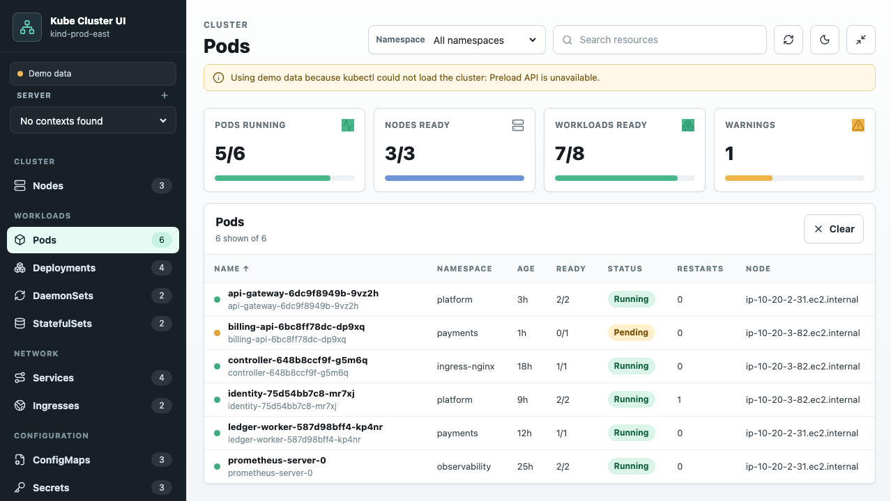
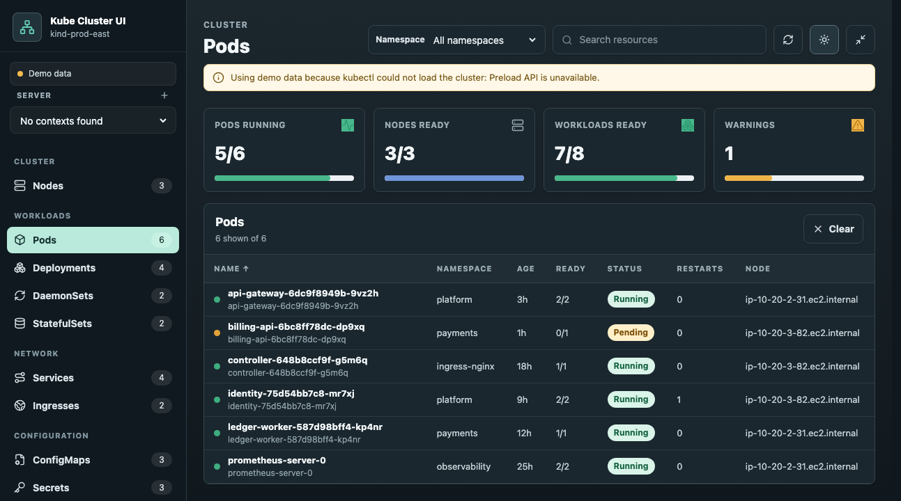

# Kube Cluster UI

[](https://github.com/contd/kube-cluster-ui/actions/workflows/release.yml)
[](https://github.com/contd/kube-cluster-ui/actions/workflows/release.yml)
[](https://github.com/contd/kube-cluster-ui/actions/workflows/release.yml)
[](https://github.com/contd/kube-cluster-ui/actions/workflows/release.yml)


<table>
	<tr>
		<td></td>
		<td></td>
	</tr>
</table>

## Features

Kube Cluster UI is a desktop Kubernetes dashboard designed to make cluster inspection fast and approachable without a full Lens-style desktop experience.

- Browse core Kubernetes resources such as namespaces, workloads, services, ingresses, pods, nodes, and config objects
- Inspect resource details, manifests, events, and status in a single interface with quick filtering and sorting
- Switch between light and dark themes and use compact mode for denser cluster views
- Connect to a real kubeconfig or fall back to bundled demo data when a cluster is unavailable
- Package and ship the app natively for Windows, macOS, and Linux

## Latest builds

Download the newest packaged releases from GitHub:

- [Latest release](https://github.com/contd/kube-cluster-ui/releases/latest)
- [Latest `GitHub` Actions build](https://github.com/contd/kube-cluster-ui/actions/workflows/release.yml)
- [`Windows` builds](https://github.com/contd/kube-cluster-ui/releases/latest)
- [`macOS` builds](https://github.com/contd/kube-cluster-ui/releases/latest)
- [`Linux` builds](https://github.com/contd/kube-cluster-ui/releases/latest)

---

## Development

### Prerequisites

Before building, install:

- `Node.js` LTS (18+ recommended; current project targets `Electron` 44)
- `Git` for `Windows`
- A `Windows` environment such as `Windows` 10/11, or a `Windows` build VM/container
- Administrator access if you need to install dependencies or sign the installer

### Install dependencies

From the project root:

```bash
npm install
```

If you are using a fresh checkout and the dependency tree is not yet restored, this will install Electron, Vite, and the Forge makers used by the project.

The project omits optional native WebSocket accelerators such as `bufferutil` and `utf-8-validate`. Kubernetes client-node uses `ws`, which automatically falls back to its JavaScript implementation, avoiding native addon compilation problems on Windows 11.

### Run locally during development

```bash
npm start
```

This starts the Electron app in development mode.

### Run Playwright UI tests

Install the Playwright browser once, then run the UI tests:

```bash
npx playwright install chromium chromium-headless-shell
npm run test:e2e
```

The tests run against the renderer with no kubeconfig available, so they use the same built-in demo data shown by the app when it cannot connect to Kubernetes. They cover every resource view and basic inspector, sorting, theme, and compact-mode interactions.

### Run unit tests

```bash
npm run test:unit
```

The unit tests cover the renderer's pure formatting, status, identity, and demo-data helper functions with multiple inputs.

### Build with Electron Builder

Electron Builder is configured in [electron-builder.yml](electron-builder.yml) for all desktop platforms. It uses the Forge Vite plugin to compile the application bundles, then creates native distributables in `dist/`:

```bash
npm run package:builder
```

The configured targets are:

- Windows: NSIS installer, portable executable, and zip
- macOS: DMG and zip
- Linux: AppImage, deb, rpm, and tar.gz

## Useful commands summary

```bash
npm install
npm start
npm run package:builder
npm run test:e2e
npm run test:unit
npm run test
```
