# Kube Cluster UI

[](https://github.com/contd/kube-cluster-ui/actions/workflows/release.yml)
[](https://github.com/contd/kube-cluster-ui/actions/workflows/release.yml)
[](https://github.com/contd/kube-cluster-ui/actions/workflows/release.yml)
[](https://github.com/contd/kube-cluster-ui/actions/workflows/release.yml)


<table>
	<tr>
		<td></td>
		<td></td>
	</tr>
</table>

## Latest builds

Download the newest packaged releases from GitHub:

- [`Windows` builds](https://github.com/contd/kube-cluster-ui/releases/latest)
- [`macOS` builds](https://github.com/contd/kube-cluster-ui/releases/latest)
- [`Linux` builds](https://github.com/contd/kube-cluster-ui/releases/latest)
- [Latest release](https://github.com/contd/kube-cluster-ui/releases/latest)
- [Latest `GitHub` Actions build](https://github.com/contd/kube-cluster-ui/actions/workflows/release.yml)

---

[](docs/video-preview.gif)

## Features

Each entry documents a view covered by a Playwright test. When adding a navigation view, add its test, numbered snapshot, and feature note here.

- **Dashboard:** Cluster health summary cards and the context-bound command terminal. <br>
- **Nodes:** Node readiness, roles, taints, version, CPU, memory, and age. <br>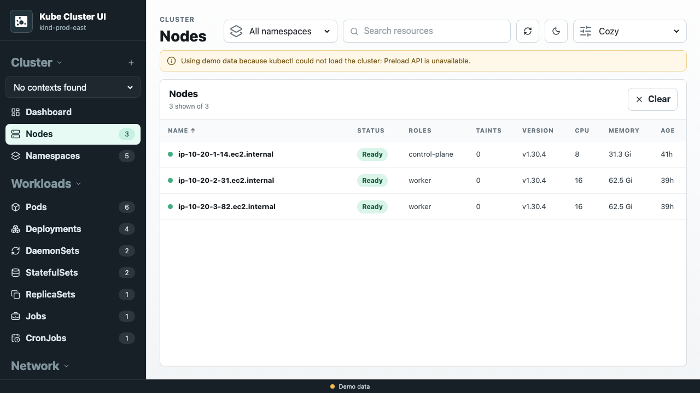
- **Namespaces:** Namespace status, age, and label summary. <br>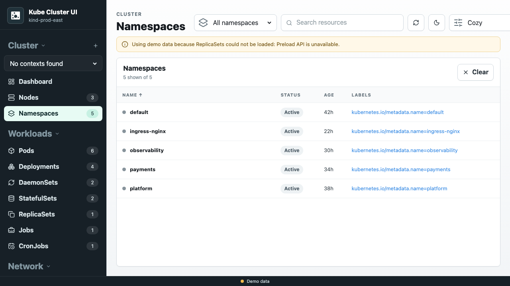
- **Pods:** Container count, phase, restarts, node placement, and controller. <br>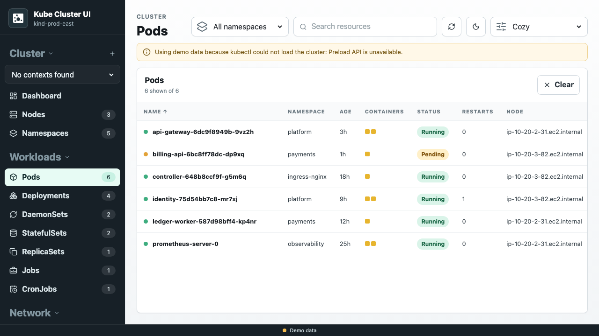
- **Deployments:** Deployment pod and replica counts. <br>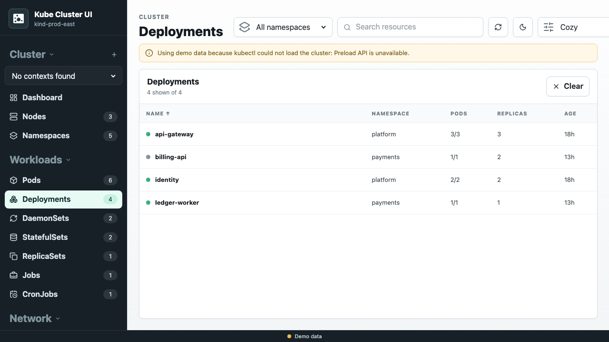
- **DaemonSets:** Desired, current, ready, updated, and available pod counts. <br>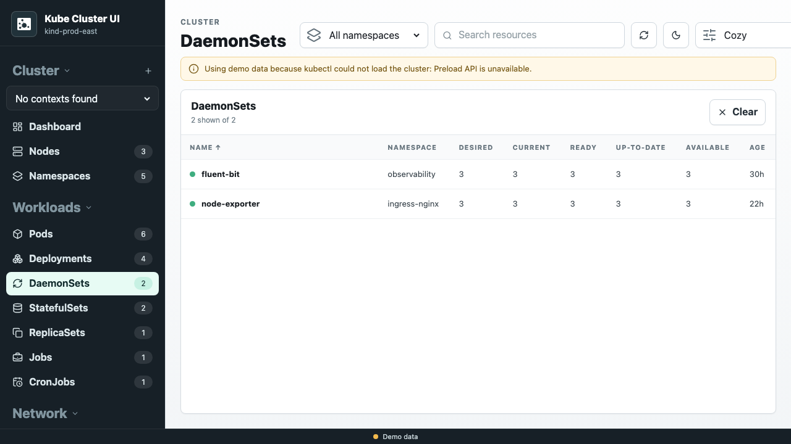
- **StatefulSets:** StatefulSet pod and replica counts. <br>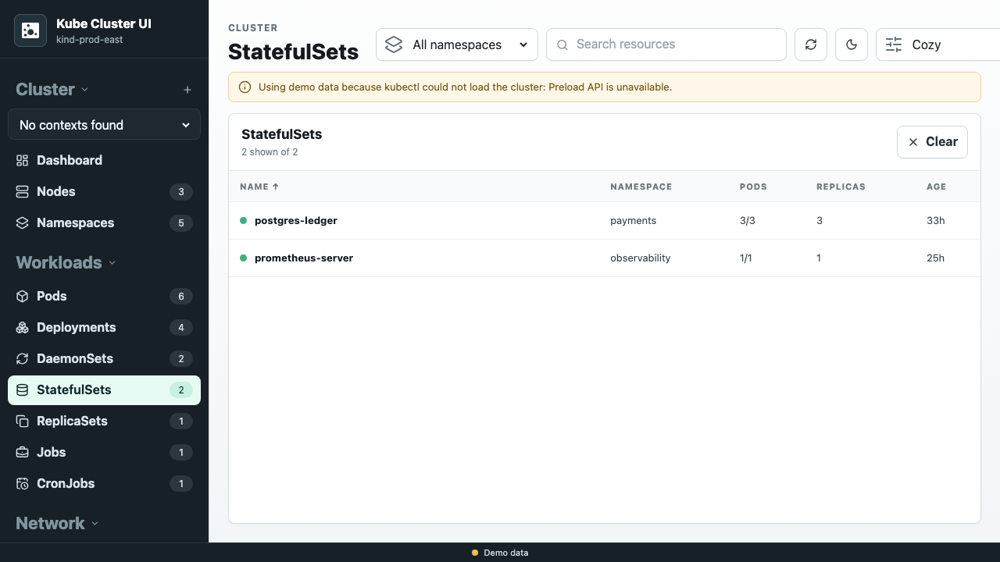
- **ReplicaSets:** Desired, current, and ready replica counts. <br>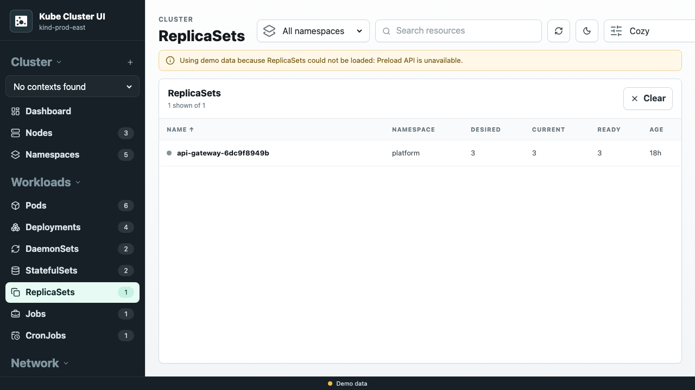
- **Jobs:** Start and end times, completion, and termination state. <br>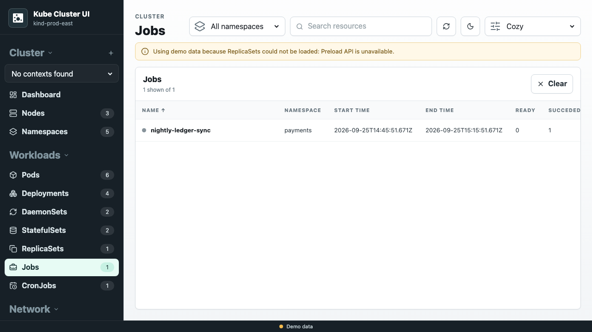
- **CronJobs:** Schedule, suspension, active jobs, and last schedule time. <br>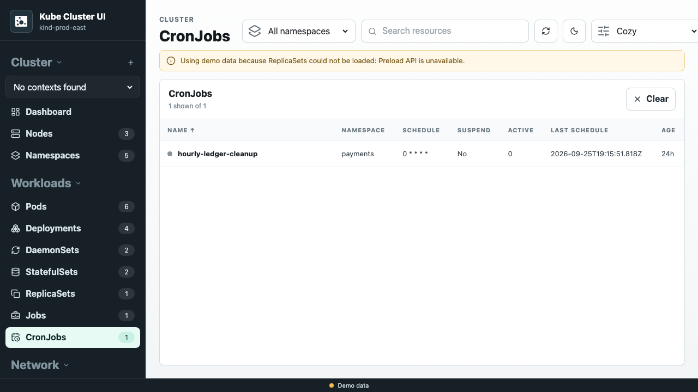
- **Persistent Volumes:** Storage class, capacity, claim, age, and status. <br>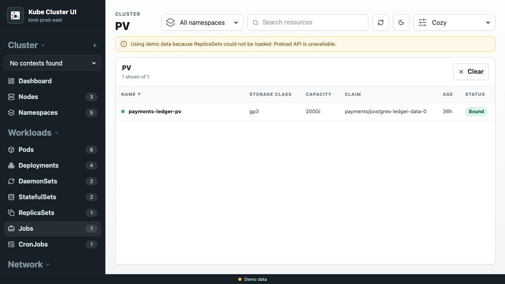
- **Storage Classes:** Provisioner, reclaim policy, binding mode, and expansion. <br>
- **Services:** Service type, cluster IP, and ports. <br>
- **Ingresses:** Ingress class and configured hosts. <br>
- **ConfigMaps:** Namespaced configuration maps and key counts. <br>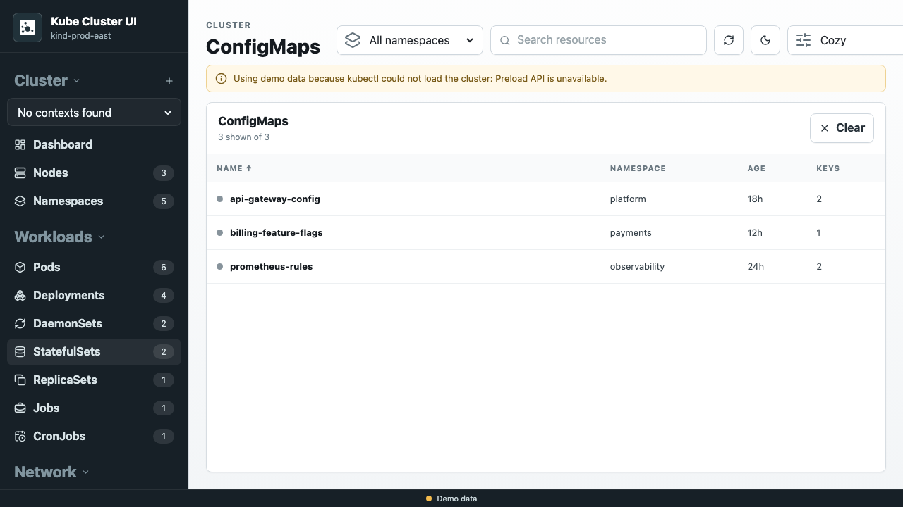
- **Secrets:** Secret type and key counts. <br>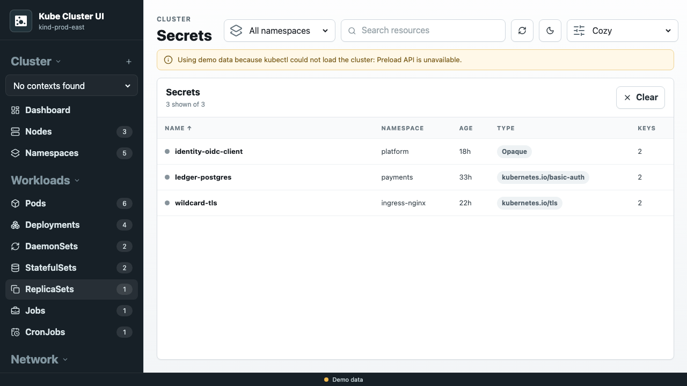
- **Persistent Volume Claims:** Claim status, capacity, and storage class. <br>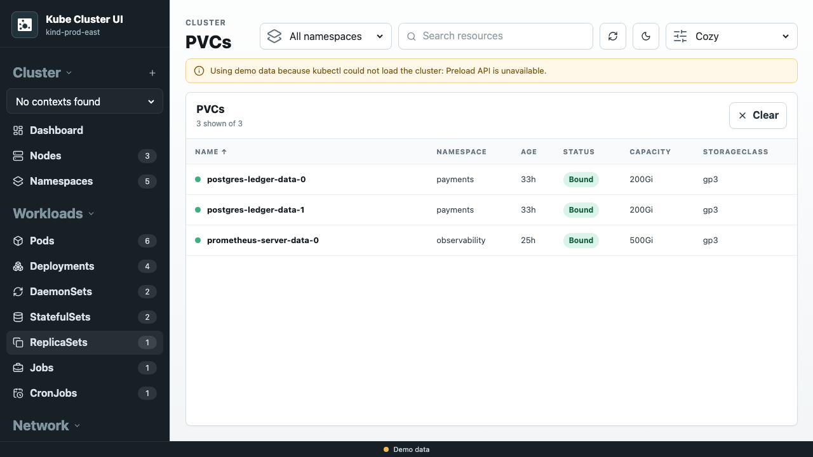
- **Events:** Event type, reason, involved object, count, and last-seen time. <br>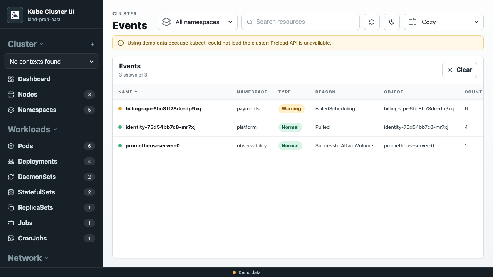
- **Unavailable terminal:** The terminal is dimmed and disabled when kubectl is missing. <br>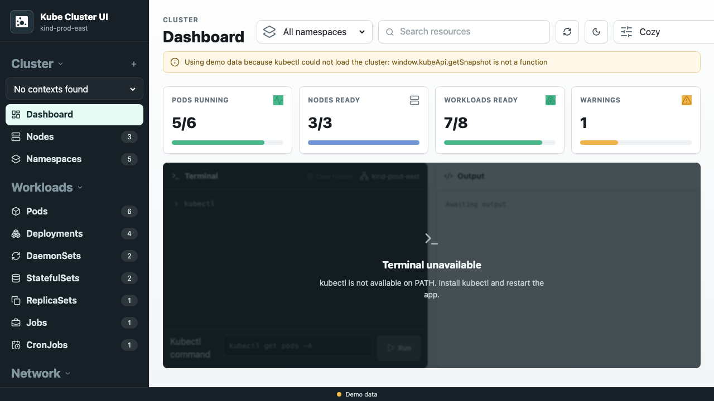

---

## Development

> For windows users see [WIN-BUILD.md](WIN-BUILD.md).

### Install dependencies

From the project root:

```bash
npm install
```

If you are using a fresh checkout and the dependency tree is not yet restored, this will install Electron, Vite, and the Forge makers used by the project.

The project omits optional native WebSocket accelerators such as `bufferutil` and `utf-8-validate`. Kubernetes client-node uses `ws`, which automatically falls back to its JavaScript implementation, avoiding native addon compilation problems on Windows 11.

### Run locally during development

```bash
npm start
```

This starts the Electron app in development mode.

### Run Playwright UI tests

Install the Playwright browser once, then run the UI tests:

```bash
npx playwright install chromium chromium-headless-shell
npm run test:e2e
```

The tests run against the renderer with no kubeconfig available, so they use the same built-in demo data shown by the app when it cannot connect to Kubernetes. They cover every resource view and basic inspector, sorting, theme, and compact-mode interactions.

### Run unit tests

```bash
npm run test:unit
```

The unit tests cover the renderer's pure formatting, status, identity, and demo-data helper functions with multiple inputs.

### Build with Electron Builder

Electron Builder is configured in [electron-builder.yml](electron-builder.yml) for all desktop platforms. It uses the Forge Vite plugin to compile the application bundles, then creates native distributables in `dist/`:

```bash
npm run package:builder
```

The configured targets are:

- Windows: NSIS installer, portable executable, and zip
- macOS: DMG and zip
- Linux: AppImage, deb, rpm, and tar.gz

## Useful commands summary

```bash
npm install
npm start
npm run package:builder
npm run test:e2e
npm run test:unit
npm run test
```
