<svg width="100%" height="100%" viewBox="0 0 1176 329" version="1.1" xmlns="http://www.w3.org/2000/svg" xmlns:xlink="http://www.w3.org/1999/xlink" xml:space="preserve" xmlns:affinity="https://www.affinity.studio/" style="fill-rule:evenodd;clip-rule:evenodd;stroke-linejoin:round;stroke-miterlimit:2;">
    <g transform="matrix(1,0,0,1,-67.659624,-100.443246)">
        <g id="main" transform="matrix(1,0,0,1,0,-200)">
            <g id="icon" transform="matrix(0.479525,0,0,0.447343,-24.487618,242.0641)">
                <path id="blue-bg" d="M418.611,177.69C498.563,133.267 503.942,119.806 537.796,139.02C545.613,143.456 617.953,184.514 635.247,194.914C703.24,235.804 704.165,234.031 772.363,274.729C812.911,298.927 827.603,304.258 831.131,325.564C832.455,333.558 831.277,642.905 832.001,664.514C832.112,667.841 832.85,689.858 812.322,701.183C806.837,704.209 568.272,839.731 562.263,843.056C527.901,862.068 523.689,867.142 506.553,865.14C502.229,864.635 496.726,863.991 457.776,841.016C456.257,840.12 456.299,840.16 420.733,820.104C407.716,812.763 302.413,753.382 258.35,727.768C213.135,701.484 196.767,697.459 192.847,675.435C191.755,669.3 192.287,397.654 192.334,373.499C192.428,325.675 189.33,315.977 207.538,300.544C214.222,294.878 321.058,234.409 418.611,177.69Z" style="fill:rgb(62,123,250);fill-opacity:0.99;"/>
                <path id="dark-bg" d="M525.46,182.569C542.115,191.84 541.982,192.045 732.787,300.001C784.652,329.346 788.941,330.735 789.768,345.481C790.019,349.961 789.651,620.737 789.655,649.5C789.658,669.662 783.714,669.798 762.65,682.765C762.605,682.793 719.866,706.981 718.212,708.003C709.724,713.252 569.2,792.67 556.226,800.003C518.202,821.492 514.287,827.052 495.771,816.028C492.655,814.173 394.167,758.061 361.27,738.89C352.234,733.624 291.07,697.979 247.755,674.038C232.228,665.456 234.228,661.665 234.235,605.501C234.215,521.501 234.196,437.5 234.176,353.5C234.156,330.92 238.361,330.898 262.247,317.063C351.506,265.367 454.222,207.86 469.297,199.129C502.634,179.82 505.894,179.519 509.466,179.188C517.559,178.439 524.301,181.963 525.46,182.569Z" style="fill:rgb(6,13,45);fill-opacity:0.99;"/>
                <g id="cube">
                    <path d="M501.336,379.466C502.075,379.424 502.761,380.009 503.5,379.967C503.517,379.966 510.011,375.606 518.334,378.913C520.648,379.833 520.183,380.534 522.455,381.5C522.818,381.654 523.271,381.236 523.634,381.39C537.484,390.46 602.616,426.716 602.607,428.504C602.601,429.741 574.087,445.224 516.202,479.005C511.492,481.754 511.023,480.391 499.734,474.052C493.459,470.529 425.611,432.436 421.692,429.318C419.947,427.93 422.196,427.755 458.289,406.15C493.438,385.11 500.121,382.697 501.336,379.466Z" style="fill:rgb(59,177,251);fill-opacity:0.98;"/>
                    <path d="M429.632,454.289C436.246,457.905 494.553,491.388 497.675,493.17C503.452,496.468 504.151,496.52 504.153,500.491C504.192,588.833 504.472,588.79 504.205,596.464C504.101,599.434 502.143,597.068 464.762,576.031C461.141,573.993 422.553,552.276 419.694,550.226C417.829,548.889 418.752,548.257 418.534,492.5C418.371,450.625 417.757,447.174 420.676,449.066C425.064,451.91 425.175,451.545 429.632,454.289Z" style="fill:rgb(55,132,250);fill-opacity:0.98;"/>
                    <path d="M605.508,480.5C605.46,548.435 605.778,548.858 604.279,550.231C602.211,552.127 531.167,592.368 524.782,595.984C520.742,598.272 520.54,596.836 520.53,596.494C520.161,583.631 520.587,508.179 520.63,500.499C520.661,494.929 522.876,495.923 535.368,488.262C540.562,485.078 540.909,485.748 601.354,450.252C601.643,450.082 605.088,448.06 605.478,449.508C605.516,449.65 605.5,449.544 605.508,480.5Z" style="fill:rgb(75,90,250);fill-opacity:0.99;"/>
                </g>
                <path id="bottom" d="M536.27,658.861C593.215,697.272 543.401,773.459 487.616,745.26C450.775,726.638 456.416,669.568 494.581,655.731C497.969,654.502 500.973,655.826 501.048,648.498C501.412,612.487 500.405,611.341 502.378,611.054C502.969,610.968 511.099,614.741 519.56,611.676C524.433,609.911 522.985,613.326 523.087,618.507C523.543,641.641 522.054,652.979 524.681,654.013C530.612,656.347 530.606,656.08 536.27,658.861Z" style="fill:rgb(52,133,250);fill-opacity:0.98;"/>
                <path id="bottom-left" d="M332.632,557.115C352.022,564.446 349.825,570.92 353.43,569.272C357.425,567.447 404.462,538.013 406.003,539.77C407.96,542.002 402.285,550.507 410.245,559.746C412.111,561.911 410.07,562.459 380.703,579.844C367.854,587.45 363.612,589.042 363.942,591.424C364.051,592.211 372.34,622.807 344.2,643.087C309.339,668.212 255.509,634.674 273.938,585.665C276.142,579.802 293.868,545.72 332.632,557.115Z" style="fill:rgb(55,139,250);fill-opacity:0.98;"/>
                <path id="bottom-right" d="M720.622,557.15C773.589,577.507 757.193,653.173 704.499,651.513C678.482,650.694 654.887,626.148 659.931,594.573C661.029,587.693 658.218,588.621 652.211,584.979C614.179,561.922 613.223,562.287 613.376,560.476C613.463,559.435 617.533,557.876 618.117,549.473C618.701,541.061 617.145,538.04 620.457,539.605C631.306,544.732 670.474,570.151 672.424,569.306C677.924,566.925 688.975,548.097 720.622,557.15Z" style="fill:rgb(55,138,250);fill-opacity:0.98;"/>
                <path id="top-right" d="M696.394,347.126C699.143,346.523 716.627,342.683 731.243,351.914C771.309,377.22 756.426,426.895 724.31,438.011C692.298,449.09 672.601,426.202 672.215,425.879C671.28,425.096 666.67,427.839 666.231,428.1C665.559,428.499 665.522,428.409 657.776,432.991C622.871,453.639 618.461,455.998 618.317,453.547C617.664,442.476 618.616,442.491 617.498,431.5C617.15,428.077 658.282,406.72 660.221,404.28C661.955,402.098 650.516,362.118 696.394,347.126Z" style="fill:rgb(55,143,250);fill-opacity:0.98;"/>
                <path id="top-left" d="M328.589,347.202C331.138,348.045 344.991,350.595 355.923,366.207C370.06,386.396 361.977,402.79 364.635,405.339C365.899,406.551 406.424,428.71 406.806,431.449C407.016,432.959 406.157,432.923 406.109,450.491C406.1,453.722 406.464,455.845 403.592,454.307C354.224,427.869 354.091,423.587 350.79,426.79C309.524,466.836 247.702,415.956 275.793,369.679C294.039,339.62 324.105,346.218 328.589,347.202Z" style="fill:rgb(55,145,250);fill-opacity:0.98;"/>
                <g id="top" transform="matrix(1,0,0,0.918587,0,18.812946)">
                    <path d="M501.336,379.466C501.042,326.095 500.926,325.484 499.368,324.856C498.464,324.491 474.717,319.846 465.749,293.422C452.617,254.73 500.771,210.105 542.16,241.916C567.754,261.588 568.839,309.951 525.434,324.314C522.301,325.351 523.337,326.712 523.208,365.5C523.164,378.81 522.955,378.789 523.634,381.39C523.271,381.236 522.818,381.654 522.455,381.5C520.183,380.534 520.648,379.833 518.334,378.913C510.011,375.606 503.517,379.966 503.5,379.967C502.761,380.009 502.075,379.424 501.336,379.466Z" style="fill:rgb(54,153,250);fill-opacity:0.98;"/>
                </g>
            </g>
            <g id="title" transform="matrix(1,0,0,1,-16,-5)">
                <g transform="matrix(0.652247,0,0,0.652247,137.710657,258.497882)">
                    <text x="487px" y="408px" style="font-family:'OriyaMN', 'Oriya MN';font-size:293.17px;fill:rgb(58,174,248);">ORBIT<tspan x="1352.051px " y="408px ">A</tspan></text>
                </g>
                <g id="dash" transform="matrix(0.87619,0,0,0.692308,153.247619,161.846154)">
                    <rect x="1157" y="500" width="105" height="26" style="fill:rgb(54,130,247);"/>
                </g>
            </g>
        </g>
    </g>
</svg>

[](https://github.com/contd/orbita/actions/workflows/release.yml)
[](https://github.com/contd/orbita/actions/workflows/release.yml)
[](https://github.com/contd/orbita/actions/workflows/release.yml)
[](https://github.com/contd/orbita/actions/workflows/release.yml)

**An open-source desktop workspace for browsing Kubernetes clusters.**

Kubernetes GUI tools can involve trade-offs: some are proprietary or place key workflows behind paid tiers, while others can feel heavier and slower than everyday cluster work needs. Orbita aims to make common inspection tasks quick and approachable, with a focused desktop interface for cluster health, workloads, configuration, access control, and events.

Browse resources, inspect manifests, switch contexts, and run context-bound `kubectl` commands from one application. The project is built with Electron and TypeScript, and is available for Windows, macOS, and Linux.

## Project Support

Orbita is currently supported by:


[Apex Supply Chain Technologies](https://www.apexsupplychain.com)


[Veratas Automata](https://veritasautomata.com/)

## Downloads and Links

Download the latest packaged release for your platform:

- [Windows](https://github.com/contd/orbita/releases/latest)
- [macOS](https://github.com/contd/orbita/releases/latest)
- [Linux](https://github.com/contd/orbita/releases/latest)
- [Latest release](https://github.com/contd/orbita/releases/latest)
- [Latest GitHub Actions build](https://github.com/contd/orbita/actions/workflows/release.yml)
- [Latest build test reports](https://github.com/contd/orbita/wiki)

## Watch the demo

[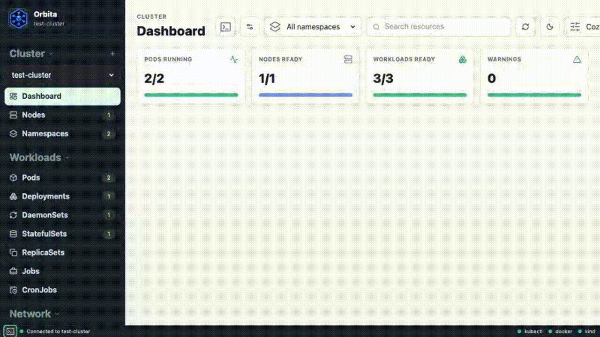](assets/video-preview.gif)

## Features

Expand a feature to view its Playwright screenshot. The same test suite covers each resource view and key interactions.

- **Dashboard:** Cluster health summaries, context-aware kubectl terminal, and CLI availability.
	<details><summary>View Dashboard screenshot</summary>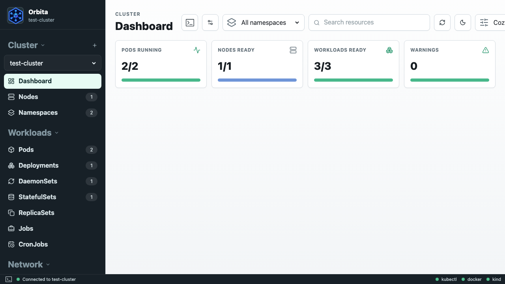</details>
- **Nodes:** Readiness, roles, taints, Kubernetes version, CPU, memory, and age.
	<details><summary>View Nodes screenshot</summary>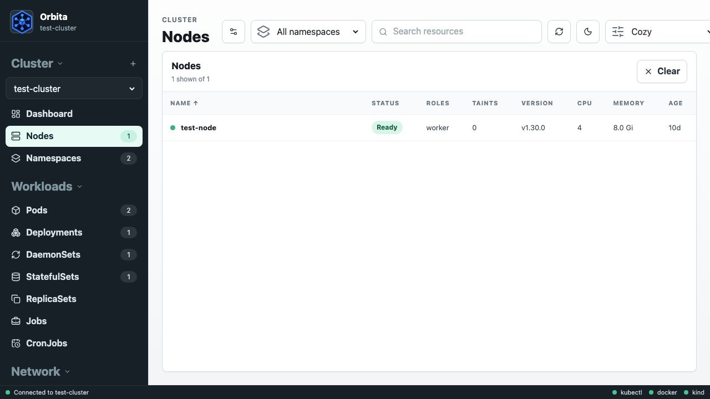</details>
- **Namespaces:** Namespace status, age, and label summary.
	<details><summary>View Namespaces screenshot</summary></details>
- **Pods:** Container count, phase, restarts, node placement, and controller.
	<details><summary>View Pods screenshot</summary></details>
- **Deployments:** Workload pods and replica counts.
	<details><summary>View Deployments screenshot</summary>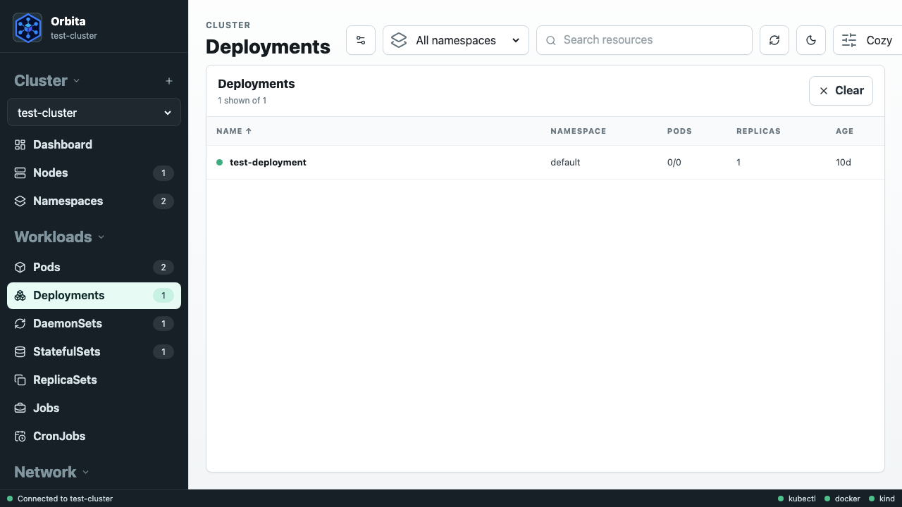</details>
- **DaemonSets:** Desired, current, ready, updated, and available pod counts.
	<details><summary>View DaemonSets screenshot</summary>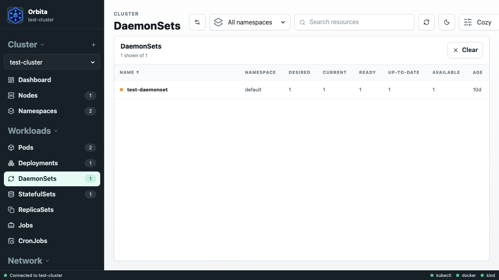</details>
- **StatefulSets:** StatefulSet pods and replica counts.
	<details><summary>View StatefulSets screenshot</summary>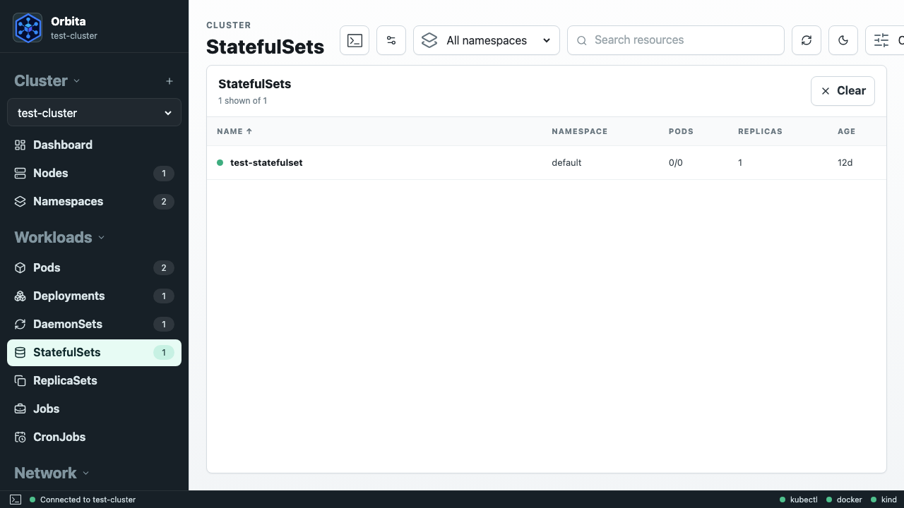</details>
- **ReplicaSets:** Desired, current, and ready replicas.
	<details><summary>View ReplicaSets screenshot</summary>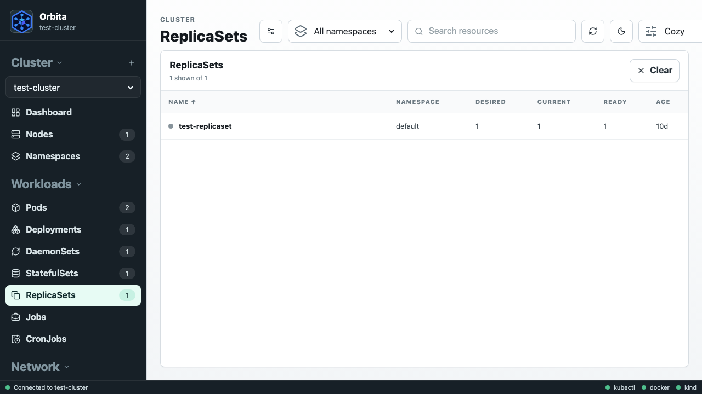</details>
- **Jobs:** Start and end times, completion, and termination state.
	<details><summary>View Jobs screenshot</summary>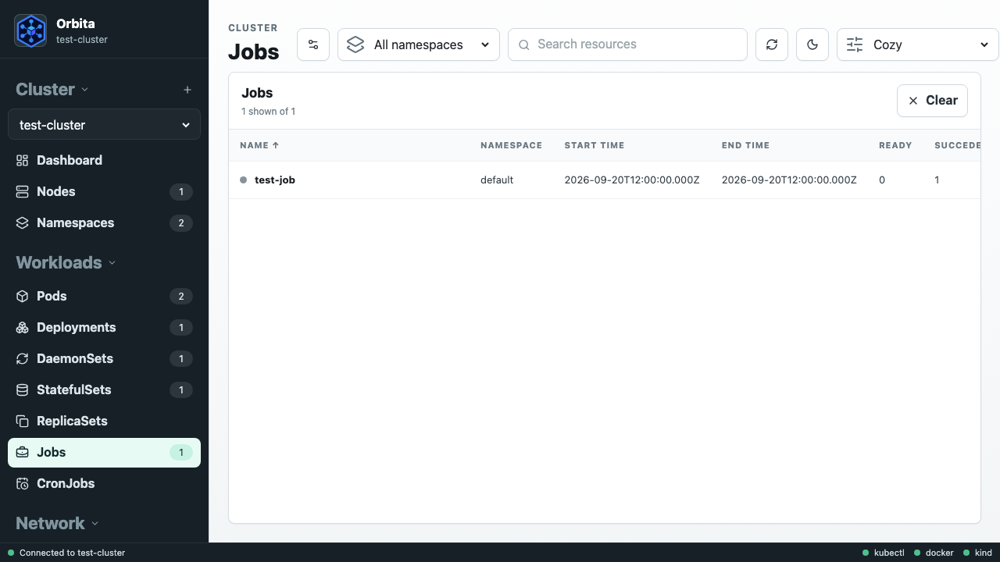</details>
- **CronJobs:** Schedule, suspension, active jobs, and last schedule time.
	<details><summary>View CronJobs screenshot</summary>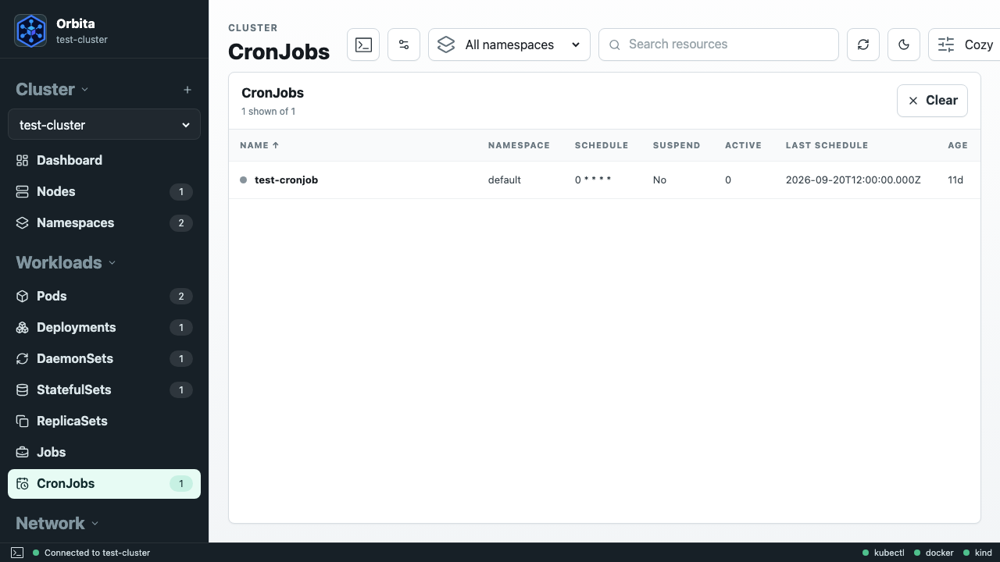</details>
- **Persistent Volumes:** Storage class, capacity, claim, age, and status.
	<details><summary>View Persistent Volumes screenshot</summary></details>
- **Storage Classes:** Provisioner, reclaim policy, binding mode, and expansion.
	<details><summary>View Storage Classes screenshot</summary></details>
- **Services:** Service type, cluster IP, and ports.
	<details><summary>View Services screenshot</summary></details>
- **Ingresses:** Ingress class and configured hosts.
	<details><summary>View Ingresses screenshot</summary>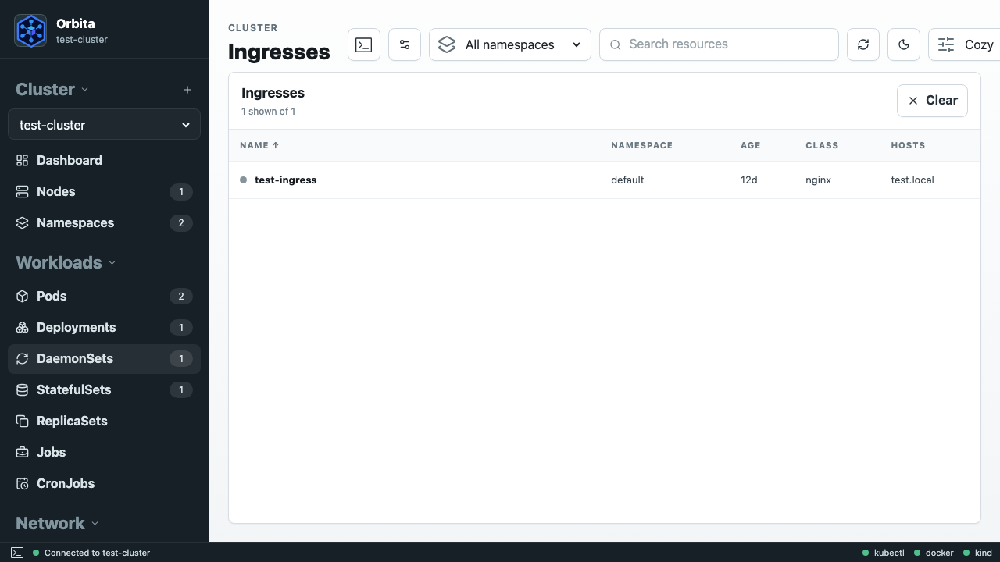</details>
- **ConfigMaps:** Namespaced configuration and key counts.
	<details><summary>View ConfigMaps screenshot</summary>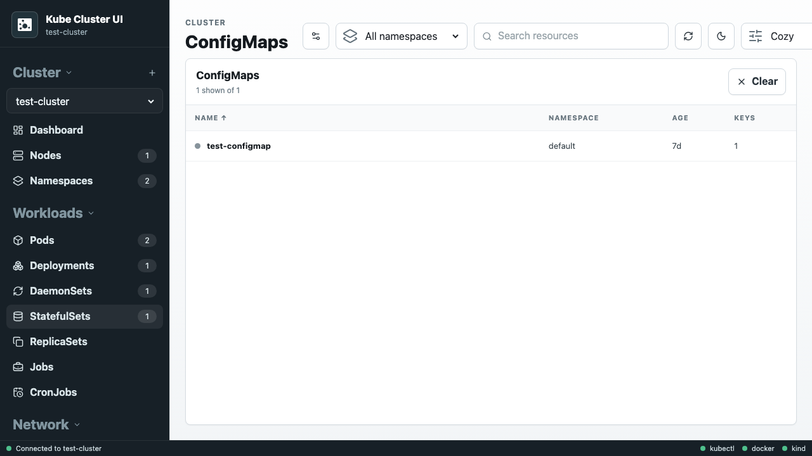</details>
- **Secrets:** Secret type and key counts.
	<details><summary>View Secrets screenshot</summary>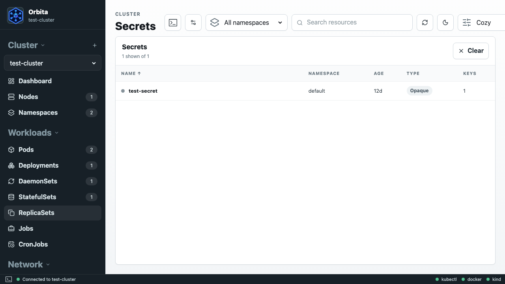</details>
- **Persistent Volume Claims:** Claim status, capacity, and storage class.
	<details><summary>View Persistent Volume Claims screenshot</summary></details>
- **Events:** Event type, reason, involved object, count, and last seen.
	<details><summary>View Events screenshot</summary>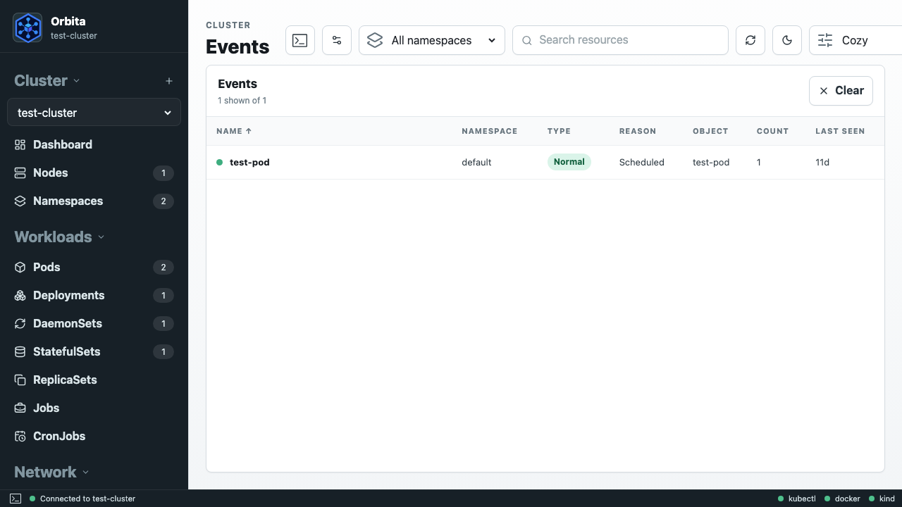</details>
- **Unavailable terminal:** The terminal is disabled when kubectl is unavailable.
	<details><summary>View unavailable terminal screenshot</summary>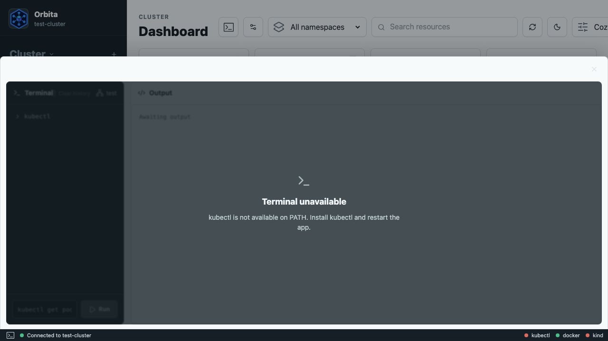</details>
- **Service Accounts:** Namespaced service accounts and secret references.
	<details><summary>View Service Accounts screenshot</summary>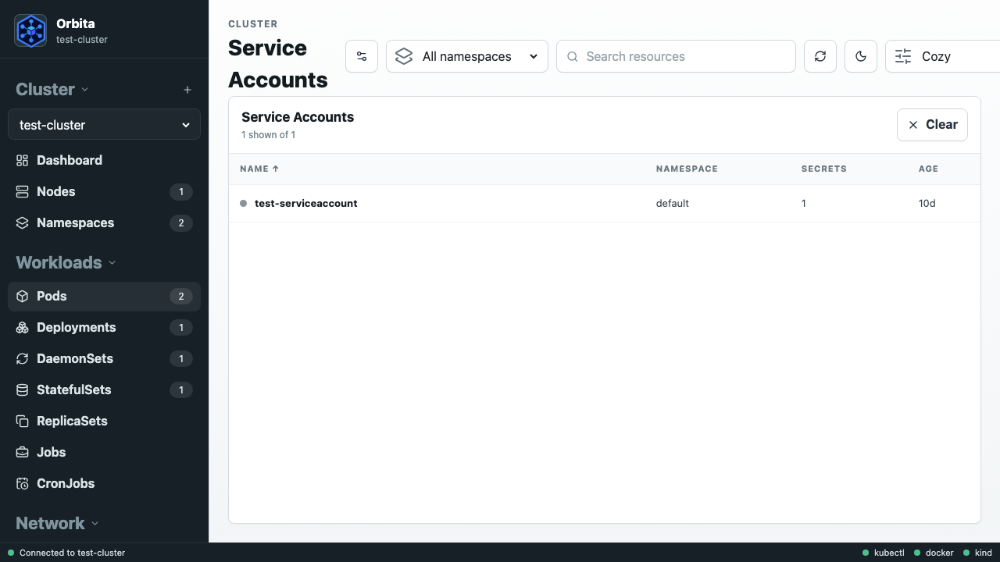</details>
- **Cluster Roles:** Cluster-wide RBAC roles and rule counts.
	<details><summary>View Cluster Roles screenshot</summary>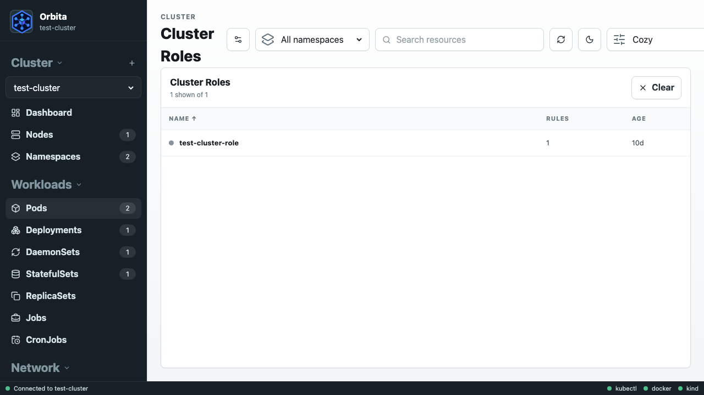</details>
- **Roles:** Namespaced RBAC roles and rule counts.
	<details><summary>View Roles screenshot</summary></details>
- **Cluster Role Bindings:** Cluster-wide role references and subject counts.
	<details><summary>View Cluster Role Bindings screenshot</summary>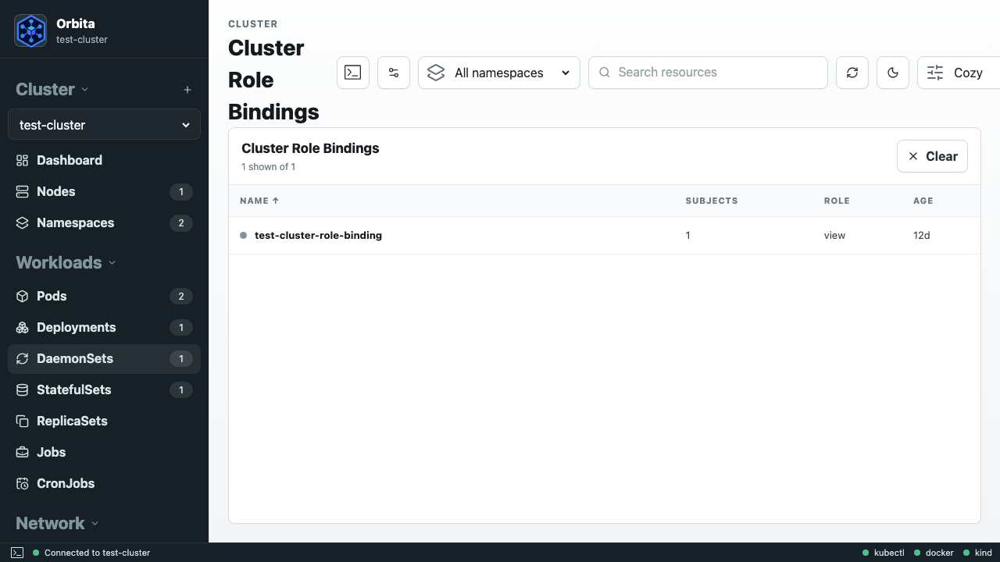</details>
- **Role Bindings:** Namespaced role references and subject counts.
	<details><summary>View Role Bindings screenshot</summary></details>
- **Settings:** Kubeconfig search path and detected CLI executable locations.
	<details><summary>View Settings screenshot</summary>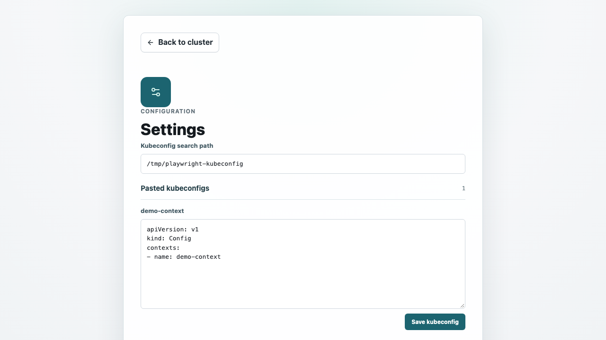</details>
- **Saved kubeconfigs:** Edit previously pasted kubeconfig documents.
	<details><summary>View saved kubeconfigs screenshot</summary></details>

---

## Development

### Install dependencies

From the project root:

```bash
npm install
```

If you are using a fresh checkout and the dependency tree is not yet restored, this will install Electron, Vite, and the Forge makers used by the project.

The project omits optional native WebSocket accelerators such as `bufferutil` and `utf-8-validate`. Kubernetes client-node uses `ws`, which automatically falls back to its JavaScript implementation, avoiding native addon compilation problems on Windows 11.

### Run locally during development

```bash
npm start
```

This starts the Electron app in development mode.

### Run Playwright UI tests

Install the Playwright browser once, then run the UI tests:

```bash
npx playwright install chromium chromium-headless-shell
npm run test:e2e
```

The tests use a deterministic mocked live cluster, so they do not require kubectl, a kubeconfig, or a live Kubernetes cluster. They cover every resource view and basic inspector, sorting, theme, and compact-mode interactions. The e2e run records `assets/snapshots/video.webm` and generates `assets/video-preview.gif` with ffmpeg.

### Run unit tests

```bash
npm run test:unit
```

The unit tests cover the renderer's pure formatting, status, identity, and demo-data helper functions with multiple inputs.

### Build with Electron Builder

Electron Builder is configured in [electron-builder.yml](electron-builder.yml) for all desktop platforms. It uses the Forge Vite plugin to compile the application bundles, then creates native distributables in `dist/`:

```bash
npm run package:builder
```

The configured targets are:

- Windows: NSIS installer, portable executable, and zip
- macOS: DMG and zip
- Linux: AppImage, deb, rpm, and tar.gz

## Useful commands summary

```bash
npm install
npm start
npm run package:builder
npm run test:e2e
npm run test:unit
npm run generate:video-preview
npm run test
```
---

## Build and Package for Windows

On a Windows machine, you can build and package the app into a Windows installer or distributable zip.

> Important: the Windows installer is produced on a Windows machine. The `MakerSquirrel` configuration is Windows-specific and is not meant to be run from a non-Windows host for native Windows packaging.

### Prerequisites

Before building, install:

- `Node.js` LTS (18+ recommended; current project targets `Electron` 44)
- `Git` for `Windows`
- A `Windows` environment such as `Windows` 10/11, or a `Windows` build VM/container
- Administrator access if you need to install dependencies or sign the installer

### Create a Windows installer

To build the Windows distributable using the configured Forge makers:

```bash
npm run make
```

This uses Electron Forge with the Squirrel maker configured in [forge.config.ts](forge.config.ts). On Windows, this produces the installer artifacts in the `out/make` directory, typically under a path similar to:

```text
out\make\squirrel.windows\x64\
```

The generated files usually include:

- the `.exe` installer
- a `.nupkg` package
- a ZIP archive if the project is configured to emit one

### Build a release artifact from the command line

If you want to trigger a package build in a CI or release script, you can run:

```bash
npm run make
```

or, for a non-installer package only:

```bash
npm run package:builder
```

### Common troubleshooting

- If `npm install` fails, make sure Node.js is installed and `npm` is on your `PATH`.
- If the Windows build fails, verify you are running the commands on a Windows machine.
- If the app does not launch after packaging, open the generated app and confirm the required runtime dependencies are present.
- If you need signing for a production release, add code-signing configuration before publishing the installer.

### Notes

- The project defines `@electron-forge/maker-squirrel` in [forge.config.ts](forge.config.ts), which is the Windows installer generator.
- The project also includes a GitHub publisher configuration in the same Forge config for release publishing, but the installer creation itself is driven by `npm run make`.

