# Kube Cluster UI

[](https://github.com/contd/kube-cluster-ui/actions/workflows/release.yml)
[](https://github.com/contd/kube-cluster-ui/actions/workflows/release.yml)
[](https://github.com/contd/kube-cluster-ui/actions/workflows/release.yml)
[](https://github.com/contd/kube-cluster-ui/actions/workflows/release.yml)

**An open-source desktop workspace for browsing Kubernetes clusters.**

Kubernetes GUI tools can involve trade-offs: some are proprietary or place key workflows behind paid tiers, while others can feel heavier and slower than everyday cluster work needs. Kube Cluster UI aims to make common inspection tasks quick and approachable, with a focused desktop interface for cluster health, workloads, configuration, access control, and events.

Browse resources, inspect manifests, switch contexts, and run context-bound `kubectl` commands from one application. The project is built with Electron and TypeScript, and is available for Windows, macOS, and Linux.

## Project Support

Kube Cluster UI is currently supported by:

- Apex Industrial Technologies
- Veratas Automata

## Downloads and Links

Download the latest packaged release for your platform:

- [Windows](https://github.com/contd/kube-cluster-ui/releases/latest)
- [macOS](https://github.com/contd/kube-cluster-ui/releases/latest)
- [Linux](https://github.com/contd/kube-cluster-ui/releases/latest)
- [Latest release](https://github.com/contd/kube-cluster-ui/releases/latest)
- [Latest GitHub Actions build](https://github.com/contd/kube-cluster-ui/actions/workflows/release.yml)
- [Latest build test reports](https://github.com/contd/kube-cluster-ui/wiki)

<details>
<summary>Watch the demo</summary>

[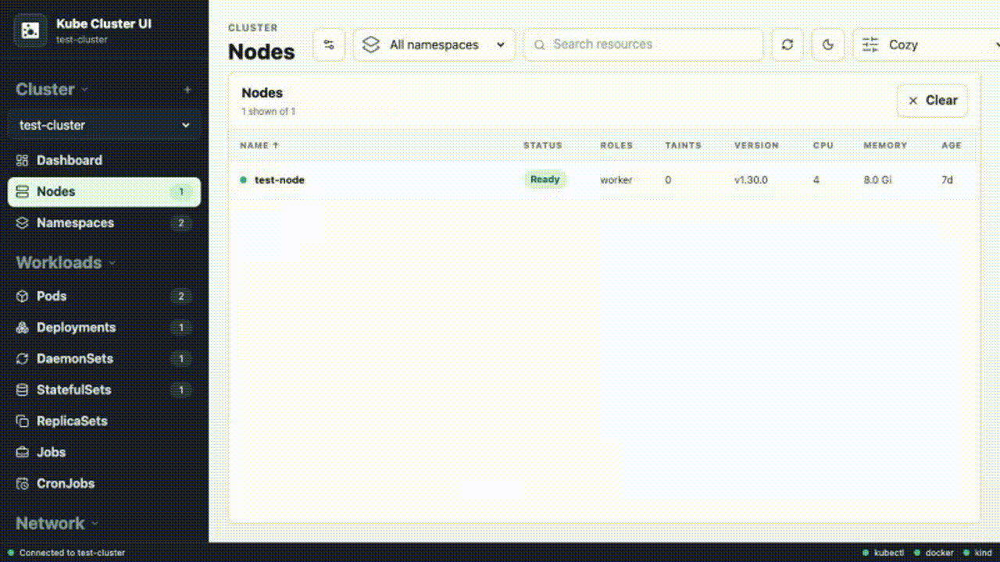](docs/video-preview.gif)
</details>

## Features

Expand a feature to view its Playwright screenshot. The same test suite covers each resource view and key interactions.

- **Dashboard:** Cluster health summaries, context-aware kubectl terminal, and CLI availability.
	<details><summary>View Dashboard screenshot</summary>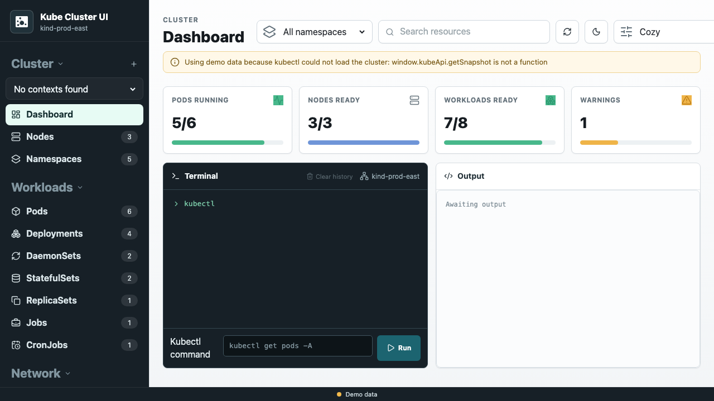</details>
- **Nodes:** Readiness, roles, taints, Kubernetes version, CPU, memory, and age.
	<details><summary>View Nodes screenshot</summary>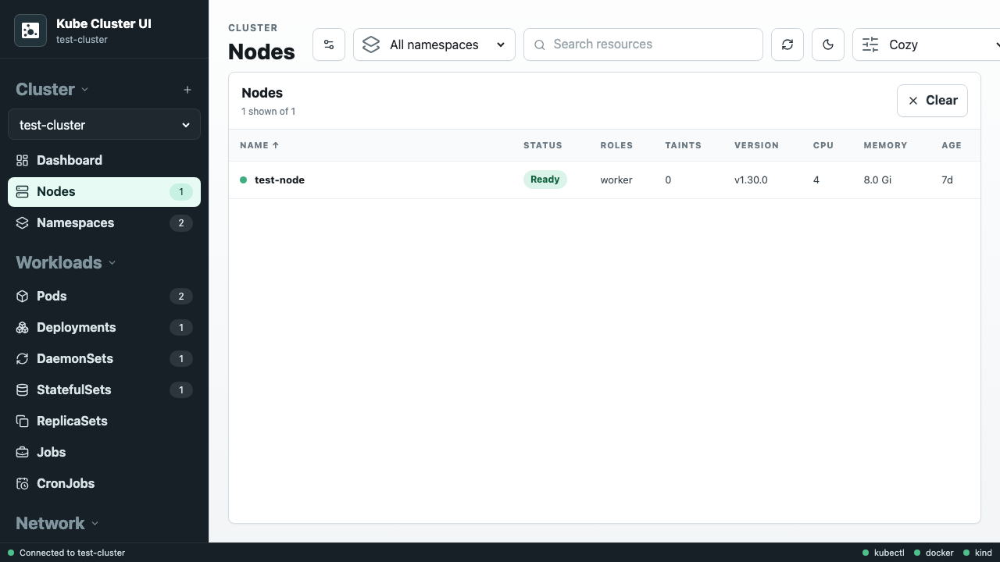</details>
- **Namespaces:** Namespace status, age, and label summary.
	<details><summary>View Namespaces screenshot</summary>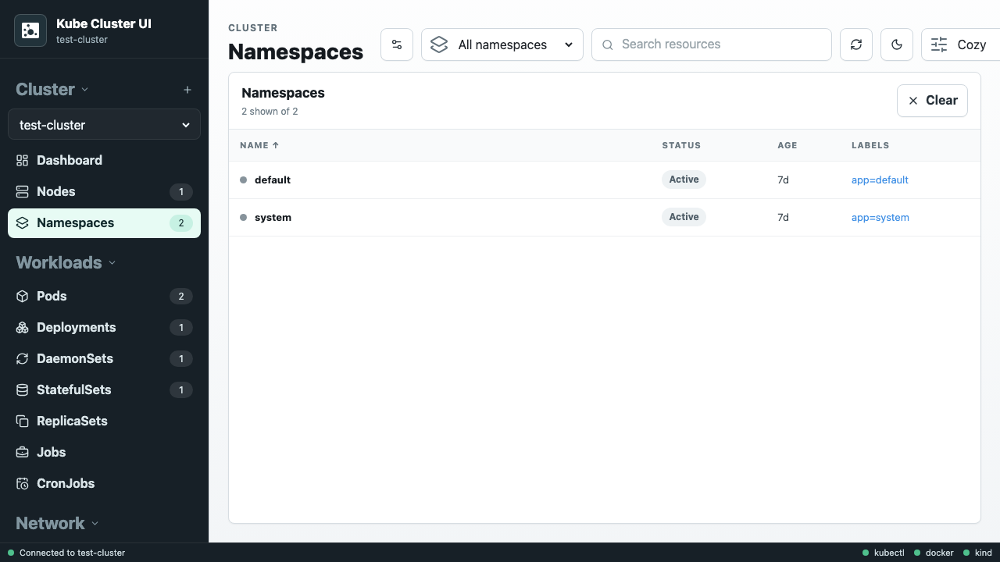</details>
- **Pods:** Container count, phase, restarts, node placement, and controller.
	<details><summary>View Pods screenshot</summary>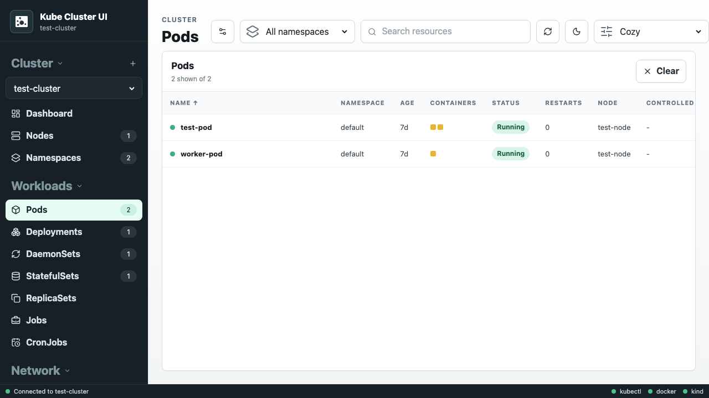</details>
- **Deployments:** Workload pods and replica counts.
	<details><summary>View Deployments screenshot</summary>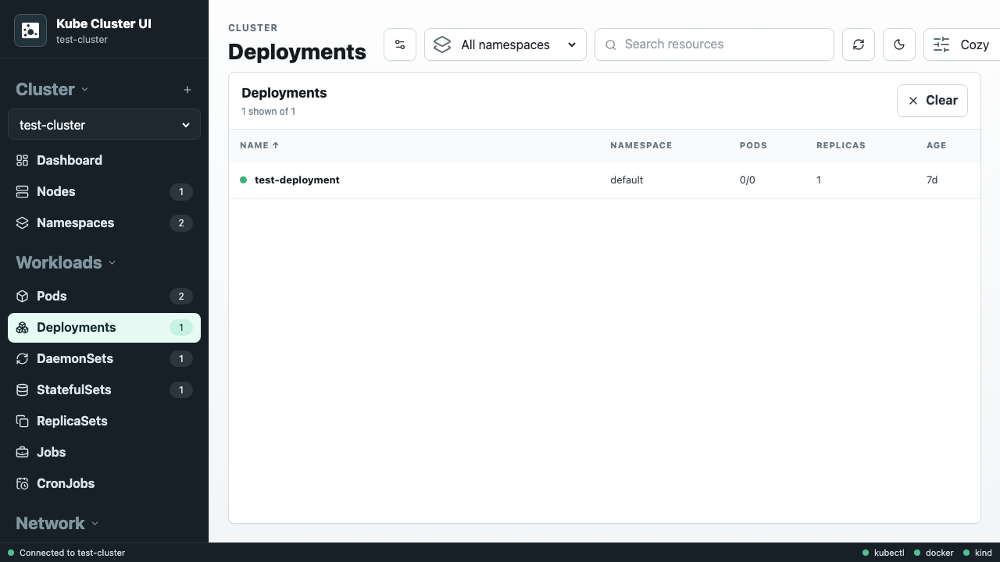</details>
- **DaemonSets:** Desired, current, ready, updated, and available pod counts.
	<details><summary>View DaemonSets screenshot</summary>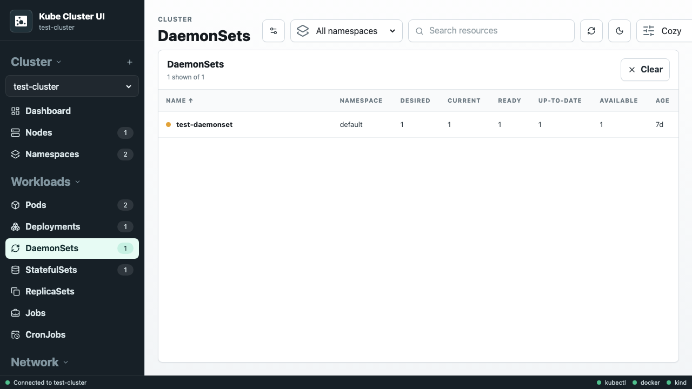</details>
- **StatefulSets:** StatefulSet pods and replica counts.
	<details><summary>View StatefulSets screenshot</summary>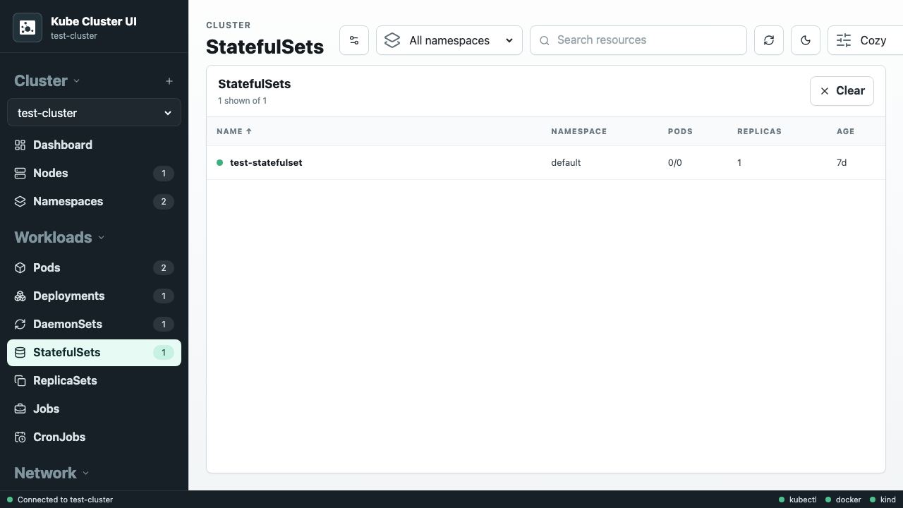</details>
- **ReplicaSets:** Desired, current, and ready replicas.
	<details><summary>View ReplicaSets screenshot</summary>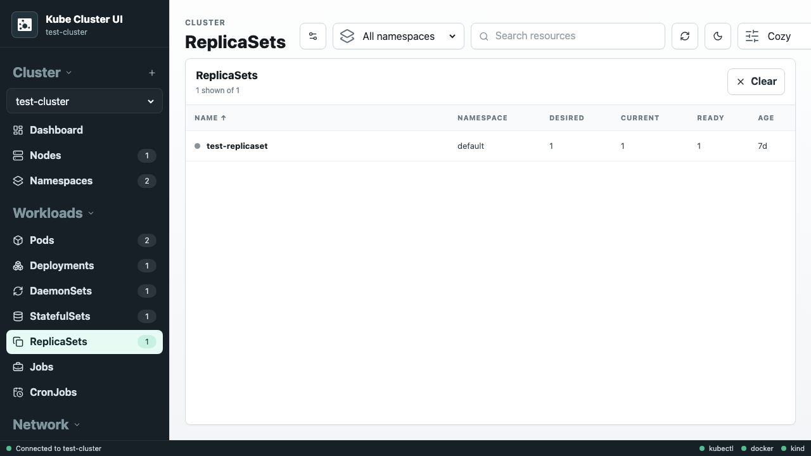</details>
- **Jobs:** Start and end times, completion, and termination state.
	<details><summary>View Jobs screenshot</summary>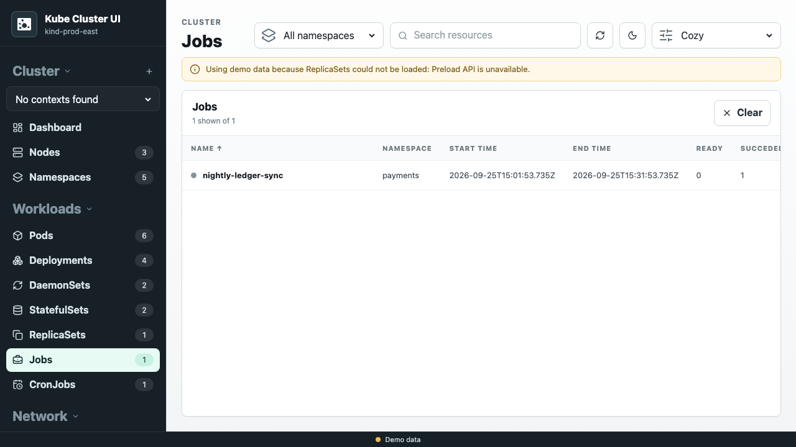</details>
- **CronJobs:** Schedule, suspension, active jobs, and last schedule time.
	<details><summary>View CronJobs screenshot</summary>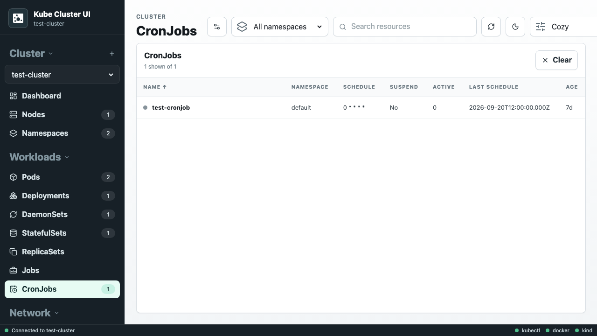</details>
- **Persistent Volumes:** Storage class, capacity, claim, age, and status.
	<details><summary>View Persistent Volumes screenshot</summary>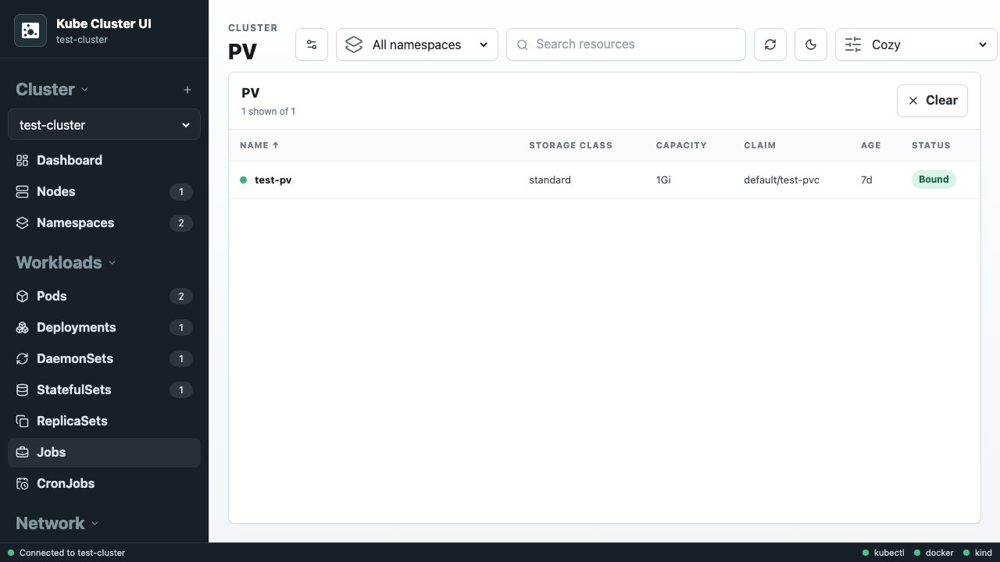</details>
- **Storage Classes:** Provisioner, reclaim policy, binding mode, and expansion.
	<details><summary>View Storage Classes screenshot</summary></details>
- **Services:** Service type, cluster IP, and ports.
	<details><summary>View Services screenshot</summary></details>
- **Ingresses:** Ingress class and configured hosts.
	<details><summary>View Ingresses screenshot</summary></details>
- **ConfigMaps:** Namespaced configuration and key counts.
	<details><summary>View ConfigMaps screenshot</summary></details>
- **Secrets:** Secret type and key counts.
	<details><summary>View Secrets screenshot</summary></details>
- **Persistent Volume Claims:** Claim status, capacity, and storage class.
	<details><summary>View Persistent Volume Claims screenshot</summary></details>
- **Events:** Event type, reason, involved object, count, and last seen.
	<details><summary>View Events screenshot</summary>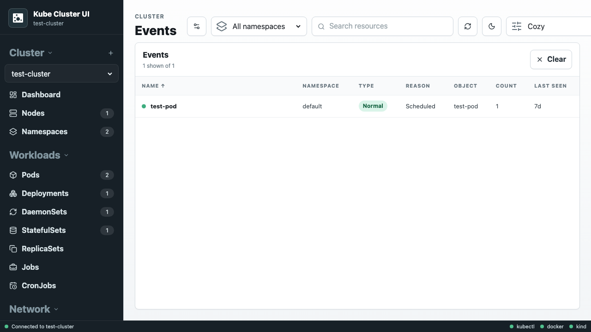</details>
- **Unavailable terminal:** The terminal is disabled when kubectl is unavailable.
	<details><summary>View unavailable terminal screenshot</summary>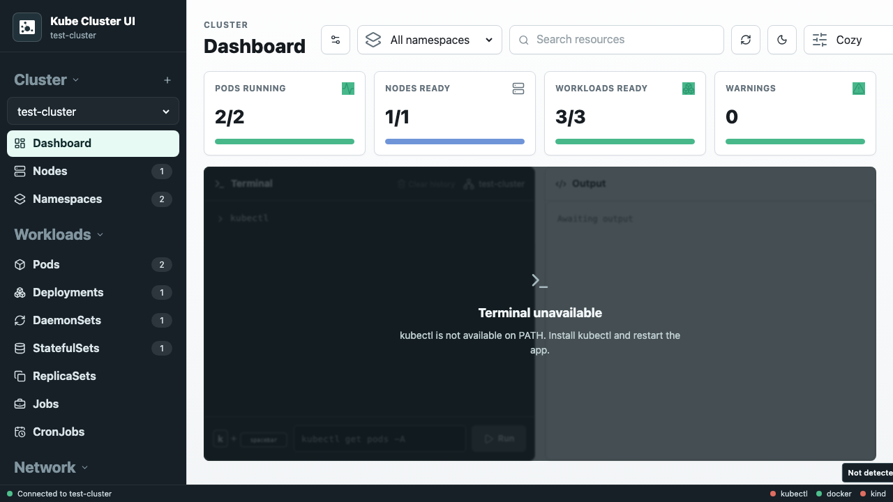</details>
- **Service Accounts:** Namespaced service accounts and secret references.
	<details><summary>View Service Accounts screenshot</summary>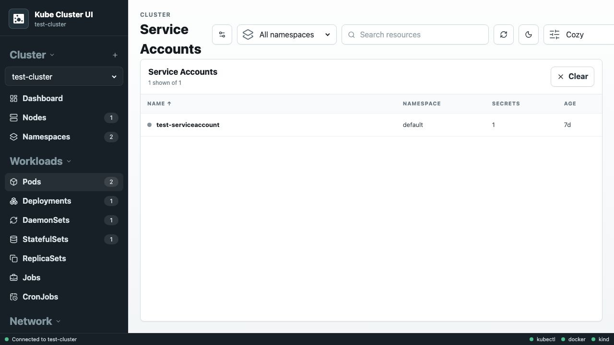</details>
- **Cluster Roles:** Cluster-wide RBAC roles and rule counts.
	<details><summary>View Cluster Roles screenshot</summary></details>
- **Roles:** Namespaced RBAC roles and rule counts.
	<details><summary>View Roles screenshot</summary></details>
- **Cluster Role Bindings:** Cluster-wide role references and subject counts.
	<details><summary>View Cluster Role Bindings screenshot</summary>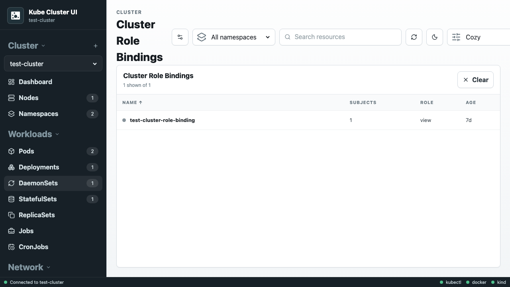</details>
- **Role Bindings:** Namespaced role references and subject counts.
	<details><summary>View Role Bindings screenshot</summary>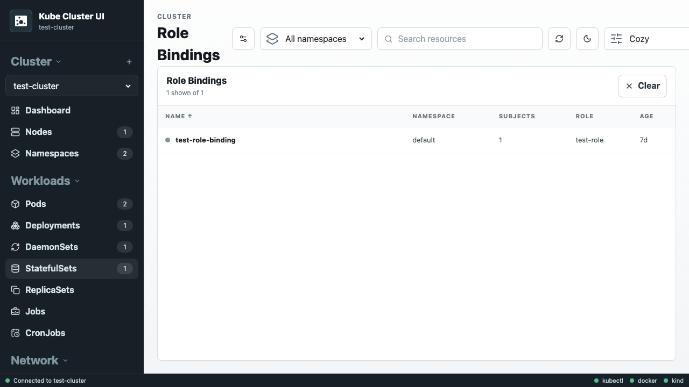</details>
- **Settings:** Kubeconfig search path and detected CLI executable locations.
	<details><summary>View Settings screenshot</summary></details>
- **Saved kubeconfigs:** Edit previously pasted kubeconfig documents.
	<details><summary>View saved kubeconfigs screenshot</summary>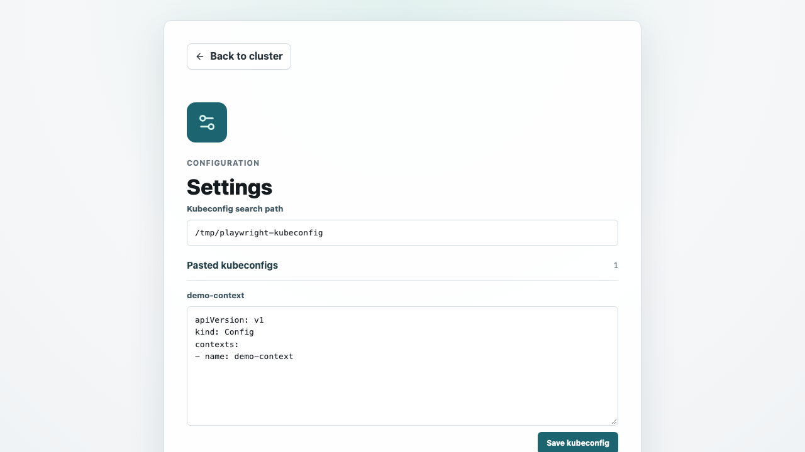</details>

---

## Development

> For windows users see [WIN-BUILD.md](WIN-BUILD.md).

### Install dependencies

From the project root:

```bash
npm install
```

If you are using a fresh checkout and the dependency tree is not yet restored, this will install Electron, Vite, and the Forge makers used by the project.

The project omits optional native WebSocket accelerators such as `bufferutil` and `utf-8-validate`. Kubernetes client-node uses `ws`, which automatically falls back to its JavaScript implementation, avoiding native addon compilation problems on Windows 11.

### Run locally during development

```bash
npm start
```

This starts the Electron app in development mode.

### Run Playwright UI tests

Install the Playwright browser once, then run the UI tests:

```bash
npx playwright install chromium chromium-headless-shell
npm run test:e2e
```

The tests use a deterministic mocked live cluster, so they do not require kubectl, a kubeconfig, or a live Kubernetes cluster. They cover every resource view and basic inspector, sorting, theme, and compact-mode interactions. The e2e run records `docs/snapshots/video.webm` and generates `docs/video-preview.gif` with ffmpeg.

### Run unit tests

```bash
npm run test:unit
```

The unit tests cover the renderer's pure formatting, status, identity, and demo-data helper functions with multiple inputs.

### Build with Electron Builder

Electron Builder is configured in [electron-builder.yml](electron-builder.yml) for all desktop platforms. It uses the Forge Vite plugin to compile the application bundles, then creates native distributables in `dist/`:

```bash
npm run package:builder
```

The configured targets are:

- Windows: NSIS installer, portable executable, and zip
- macOS: DMG and zip
- Linux: AppImage, deb, rpm, and tar.gz

## Useful commands summary

```bash
npm install
npm start
npm run package:builder
npm run test:e2e
npm run test:unit
npm run generate:video-preview
npm run test
```
