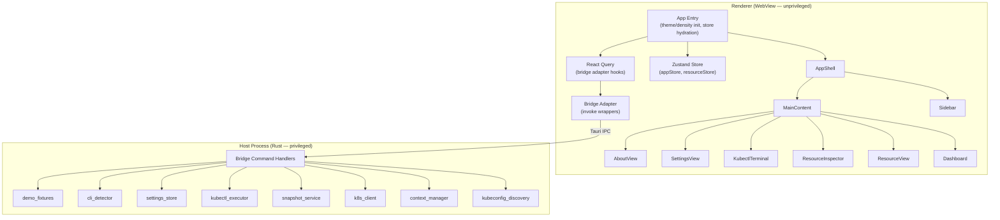
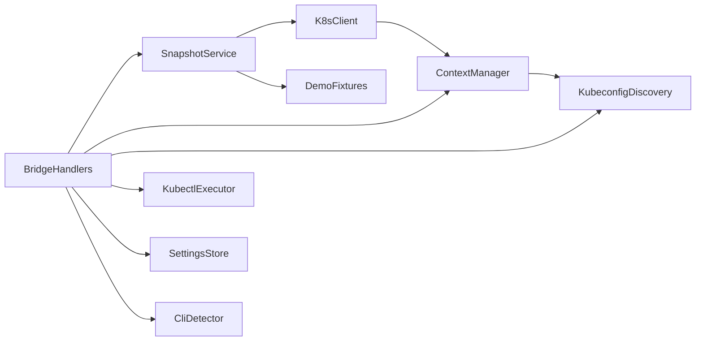
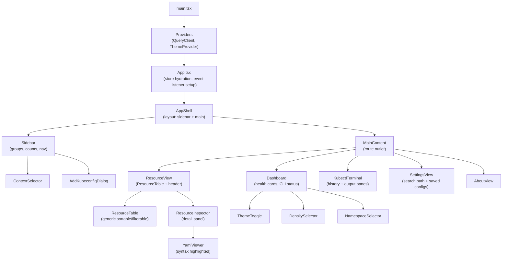
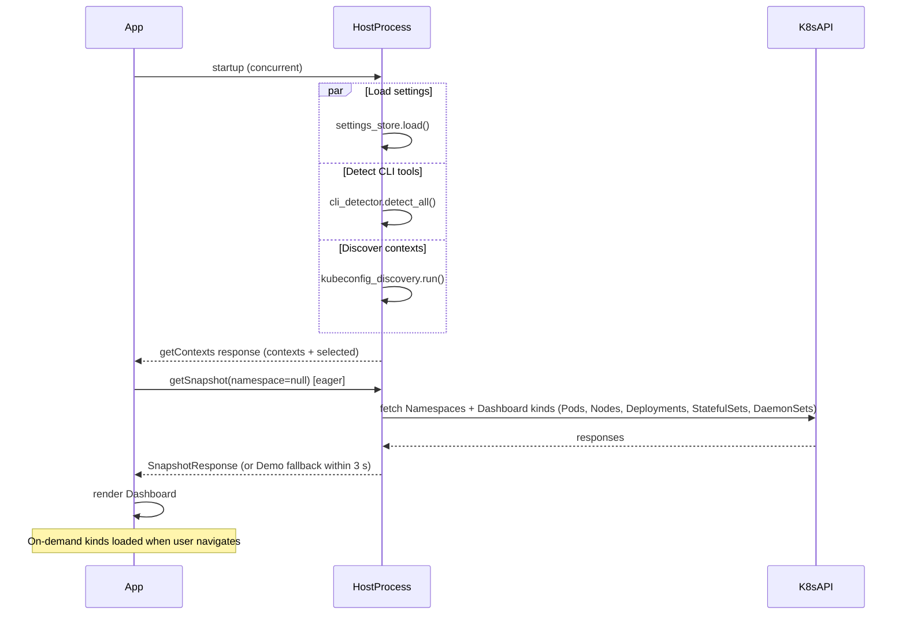
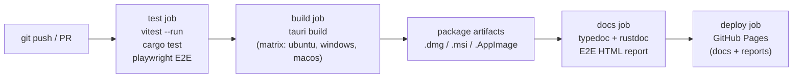

# Design Document

## k8s-cluster-browser

---

## Table of Contents

1. [Overview](#overview)
2. [Architecture](#architecture)
3. [High-Level Architecture](#high-level-architecture)
4. [Rust Backend Modules](#rust-backend-modules)
5. [React / TypeScript Frontend Modules](#react--typescript-frontend-modules)
6. [Components and Interfaces](#components-and-interfaces)
7. [Error Handling](#error-handling)
8. [Data Models](#data-models)
9. [Bridge API Contracts](#bridge-api-contracts)
10. [Demo Mode Design](#demo-mode-design)
11. [Resource Table Column Schemas](#resource-table-column-schemas)
12. [Loading Strategy](#loading-strategy)
13. [Security Design](#security-design)
14. [Testing Strategy](#testing-strategy)
15. [CI/CD and Packaging](#cicd-and-packaging)
16. [Correctness Properties](#correctness-properties)

---

## Overview

k8s-cluster-browser is a cross-platform desktop application (macOS, Windows, Linux) built with **Tauri v2** (Rust backend) and **React + TypeScript** (WebView renderer). It allows developers and operators to browse Kubernetes clusters, inspect all major resource kinds, execute guarded kubectl commands in a built-in terminal, manage multiple kubeconfigs, and operate fully offline via deterministic Demo Mode fixtures — all without requiring a live cluster to launch.

Stack summary:

| Concern | Technology |
|---|---|
| Desktop runtime | Tauri v2 |
| Backend language | Rust (stable) |
| Kubernetes client | kube-rs |
| Frontend language | TypeScript 5 |
| UI framework | React 18 |
| Global state | Zustand |
| Server state / caching | TanStack Query (React Query v5) |
| UI primitives | shadcn/ui (Radix UI + Tailwind CSS) |
| Testing (TS) | Vitest + fast-check + Playwright |
| Testing (Rust) | built-in `#[test]` + proptest |
| Release | Tauri built-in updater + GitHub Actions |

---

## Architecture

k8s-cluster-browser follows a two-process desktop architecture enforced by Tauri v2's privilege boundary. A privileged Rust host process handles all system access (filesystem, networking, subprocess execution) and exposes exactly 13 typed IPC commands to an unprivileged WebView renderer running React + TypeScript. This strict separation means the UI layer can never directly access kubeconfigs, execute subprocesses, or reach the Kubernetes API — all such operations are mediated by the bridge.

The key architectural concerns are:
- **Process isolation** — Tauri v2 ACL restricts the renderer to whitelisted bridge commands only
- **Offline-first** — Demo Mode fixtures ensure the app is fully usable without a live cluster
- **Lazy loading** — Only Dashboard-critical resource kinds are fetched at startup; other kinds load on first navigation
- **Client-side caching** — React Query provides a 30-second stale-time cache over all bridge calls

See [High-Level Architecture](#high-level-architecture) below for process diagrams and module dependency graphs.

---

## High-Level Architecture

### Process Model

Tauri v2 runs two processes separated by a strict privilege boundary:

```
┌─────────────────────────────────────────────────────────┐
│  Host Process  (Rust, privileged)                       │
│                                                         │
│  kubeconfig_discovery  context_manager  k8s_client      │
│  snapshot_service      kubectl_executor settings_store  │
│  cli_detector          demo_fixtures    bridge_handlers  │
│                                                         │
│  Capabilities: filesystem, subprocess, network (k8s)   │
└────────────────────┬────────────────────────────────────┘
                     │  Tauri Command Bridge (IPC)
                     │  13 typed commands only
                     │  No unrestricted fs / shell APIs
┌────────────────────▼────────────────────────────────────┐
│  Renderer Process  (WebView, unprivileged)               │
│                                                         │
│  React 18 + TypeScript + Zustand + React Query          │
│  shadcn/ui components (Radix UI + Tailwind)             │
│                                                         │
│  Capabilities: DOM, in-memory state, bridge IPC only    │
└─────────────────────────────────────────────────────────┘
```

### Architecture Overview (Mermaid)



### Security Boundary

The Tauri capability system is configured so the renderer:
- Has **no** `fs`, `shell`, `process`, or `http` plugins.
- Has **only** the `core:default` + `tauri-plugin-clipboard-manager` capabilities plus a custom `bridge` capability that whitelists the 13 defined command names.
- Any `invoke()` call for a command name not in the whitelist is rejected by Tauri's ACL before reaching Rust code.

---

## Rust Backend Modules

### Module Dependency Graph



---

### `kubeconfig_discovery`

Responsible for multi-source kubeconfig discovery, file traversal, deduplication, and parsing via kube-rs.

```rust
pub struct DiscoveryConfig {
    pub search_path: Option<PathBuf>,
    pub kubeconfig_env: Option<String>,      // raw KUBECONFIG env var value
    pub home_dir: PathBuf,
}

pub struct DiscoveryResult {
    pub parsed_count: usize,
    pub skipped_count: usize,
    pub kubeconfigs: Vec<ParsedKubeconfig>,
    pub warnings: Vec<DiscoveryWarning>,
}

pub struct ParsedKubeconfig {
    pub source_path: PathBuf,
    pub source_label: String,               // file name
    pub contexts: Vec<RawContext>,
}

pub struct DiscoveryWarning {
    pub path: PathBuf,
    pub reason: String,
}
```

**Discovery Algorithm:**

1. Build candidate list in priority order:
   - (1) `search_path` (file or directory; directories recurse up to depth 10, skip hidden files)
   - (2) paths from `KUBECONFIG` env var split on `:` (Unix) or `;` (Windows); if env var is set but yields no valid paths, skip to (3)
   - (3) `~/.kube/config`
   - (4) `~/kubeconfig`
2. Resolve all paths to absolute paths after symlink expansion.
3. Deduplicate by resolved absolute path (preserve first occurrence per priority order).
4. For each unique path, attempt `kube_rs::config::Kubeconfig::read_from(path)`. On error: record a `DiscoveryWarning`, increment `skipped_count`, continue.
5. Emit `DiscoveryResult`.

**Directory traversal** uses a depth-limited recursive walk:
```rust
fn walk_dir(dir: &Path, depth: usize, max_depth: usize) -> Vec<PathBuf>
```
Hidden files (name starts with `.`) are skipped at every level.

---

### `context_manager`

Converts raw parsed kubeconfigs into the typed `KubeContext` model, applies sorting and deduplication, manages the active selection, and generates stable IDs.

```rust
pub struct KubeContext {
    pub id: String,               // "{source_key}::{context_name}"
    pub name: String,
    pub cluster_name: String,
    pub user_name: String,
    pub namespace: String,        // defaults to "default"
    pub source_path: String,      // absolute path or saved kubeconfig ID
    pub source_label: String,     // file name or saved kubeconfig label
    pub is_current: bool,
}

pub struct ContextState {
    pub contexts: Vec<KubeContext>,
    pub selected_id: Option<String>,
    pub default_search_path: String,
}
```

**Stable ID generation:**
```
id = base64url(sha256("{source_path}::{context_name}"))
```
For saved kubeconfigs, `source_path` is replaced with the saved kubeconfig UUID.

**Sort key** (applied before deduplication):
```
(context_name.to_lowercase(), source_label.to_lowercase(), source_path.to_lowercase())
```
Entries equal across all three keys are deduplicated (retain first in sort order).

**Default selection:**
1. First context where `is_current == true` in the sorted list.
2. If none, first entry in the sorted list.
3. If persisted `selected_id` is found in the context list, use that instead.

---

### `k8s_client`

Manages a per-context cache of `kube::Client` instances. Clients are created lazily on first use and evicted when the context list changes.

```rust
pub struct K8sClientManager {
    clients: Arc<Mutex<HashMap<String, Arc<kube::Client>>>>,
}

impl K8sClientManager {
    pub async fn get_or_create(&self, ctx: &KubeContext) -> Result<Arc<kube::Client>>;
    pub fn evict(&self, context_id: &str);
    pub fn evict_all(&self);
}
```

Client creation uses `kube::Config::from_kubeconfig` with the context name and the appropriate kubeconfig source. Errors surface as `BridgeError::ClusterUnreachable`.

---

### `snapshot_service`

Coordinates resource loading: eager at startup (Namespaces + Dashboard data), on-demand per collection, and Demo Mode fallback.

```rust
pub enum OperationalMode { Live, Demo }

pub struct SnapshotRequest {
    pub namespace: Option<String>,   // None = all namespaces
    pub context_id: Option<String>,
    pub scope: SnapshotScope,
}

pub enum SnapshotScope {
    Full,
    Collection(ResourceKind),
    SingleResource { kind: ResourceKind, namespace: Option<String>, name: String },
}

pub struct SnapshotResponse {
    pub context_name: String,
    pub mode: OperationalMode,
    pub error: Option<String>,
    pub namespaces: Vec<String>,
    // per-kind collections (all 22 kinds)
    pub pods: ResourceCollection,
    pub nodes: ResourceCollection,
    // ... (all kinds)
}

pub struct ResourceCollection {
    pub kind: ResourceKind,
    pub items: Vec<serde_json::Value>,   // normalized JSON
    pub error: Option<String>,
}
```

**Fallback logic:** If any collection fetch fails or a timeout (30 s) elapses, `snapshot_service` substitutes Demo Mode data for that collection and sets `collection.error`. The overall `mode` remains `Live` unless all collections fail, in which case `mode` becomes `Demo`.

---

### `kubectl_executor`

Implements the guarded terminal backend: argument parsing (supporting quoted strings and backslash escapes), direct process execution (no shell), output capture, timeout enforcement, and output buffer capping.

```rust
pub struct KubectlCommand {
    pub raw: String,
    pub parsed_args: Vec<String>,
    pub context_name: String,
}

pub struct KubectlResult {
    pub stdout: String,
    pub stderr: String,
    pub exit_code: i32,
}

pub enum KubectlError {
    EmptyCommand,
    IncompleteQuote { position: usize },
    IncompleteEscape,
    ForbiddenOverride { flag: String },   // --context or --kubeconfig
    ExecutionFailed(String),
    Timeout,
    OutputBufferExceeded,
}
```

**Parser rules:**
1. Strip `kubectl`, `kubectl.exe`, or `k` prefix (case-insensitive).
2. Tokenize respecting `"..."`, `'...'`, and `\` escapes.
3. Reject if: input is empty after prefix strip; any unclosed quote; any incomplete `\` at end; any token equal to `--context` or `--kubeconfig`.
4. Inject `--context <contextName>` as first two tokens.
5. Execute via `std::process::Command::new("kubectl")` with the token array — never via shell.

**Limits:** stdout + stderr each capped at 5 MB (10 MB combined). Timeout: 120 s via `tokio::time::timeout`.

---

### `settings_store`

Persists application settings using `tauri-plugin-store` (JSON file in the platform App Data Directory).

```rust
pub struct AppSettings {
    pub selected_context_id: Option<String>,
    pub search_path: Option<String>,
    pub saved_kubeconfigs: Vec<SavedKubeconfig>,
    pub theme: Theme,
    pub density: Density,
}

pub struct SavedKubeconfig {
    pub id: String,           // stable UUID, never changes
    pub label: String,        // user-visible name
    pub yaml: String,
}

#[derive(Default)] pub enum Theme   { Light, #[default] Dark }
#[derive(Default)] pub enum Density { Cozy, #[default] Normal, Compact }
```

Default values are applied field-by-field when a field is missing or fails to deserialize, so a partial corruption never blocks startup.

**Search Path normalization:**
```rust
fn normalize_search_path(raw: &str) -> Result<PathBuf> {
    let trimmed = raw.trim();
    if trimmed.is_empty() { return Err(ValidationError::EmptyPath); }
    let expanded = shellexpand::tilde(trimmed);
    let abs = PathBuf::from(expanded.as_ref()).canonicalize()?;
    Ok(abs)
}
```

---

### `cli_detector`

Detects `kubectl`, `docker`, and `kind` concurrently at startup by running `<tool> version --client` (or equivalent) with a 5-second timeout per tool.

```rust
pub struct CliToolStatus {
    pub name: String,
    pub available: bool,
    pub message: String,
    pub path: Option<String>,
}

pub async fn detect_all() -> Vec<CliToolStatus>
```

Uses `tokio::join!` to run all three detections concurrently. If detection does not complete within 5 s, the tool is reported as `available: false`.

---

### `demo_fixtures`

A static Rust module that returns deterministic `serde_json::Value` collections for all 22+ resource kinds. Timestamps are expressed as relative offsets from a fixed epoch so they remain stable across builds.

```rust
pub fn get_demo_snapshot(namespace_filter: Option<&str>) -> SnapshotResponse
pub fn get_demo_collection(kind: ResourceKind, namespace_filter: Option<&str>) -> ResourceCollection
```

Namespace coverage: `default`, `platform`, `payments`, `observability`, `ingress-nginx`. Each kind includes at least 3–5 entries with varied status distributions (healthy, warning, danger, neutral) to exercise all Status Tone mappings, label display, age formatting, and column schemas.

---

### Bridge Command Handlers

Thin async functions registered with `tauri::Builder::invoke_handler`. Each handler:
1. Deserializes typed arguments from the IPC payload.
2. Delegates to the appropriate backend module.
3. Returns a typed `Result<T, BridgeError>` serialized as JSON.

```rust
pub enum BridgeError {
    Validation(String),
    ClusterUnreachable(String),
    NotFound(String),
    Internal(String),
}
```

---

## React / TypeScript Frontend Modules

### Component Hierarchy



---

### Zustand Store Slices

Two top-level stores are created and composed via `immer` middleware for immutable updates.

#### `appStore`

```typescript
interface AppStore {
  // Context
  contexts: KubeContext[];
  selectedContextId: string | null;
  defaultSearchPath: string;
  setContexts(state: ContextState): void;
  selectContext(id: string): void;

  // Mode
  mode: 'live' | 'demo';
  setMode(mode: 'live' | 'demo'): void;

  // Theme / Density
  theme: 'light' | 'dark';
  density: 'cozy' | 'normal' | 'compact';
  setTheme(theme: 'light' | 'dark'): void;
  setDensity(density: 'cozy' | 'normal' | 'compact'): void;

  // CLI tools
  cliTools: CliToolStatus[];
  setCliTools(tools: CliToolStatus[]): void;

  // Namespaces
  namespaces: string[];
  selectedNamespace: string | null;  // null = "All"
  setNamespaces(ns: string[]): void;
  setSelectedNamespace(ns: string | null): void;

  // Settings
  settings: AppSettings | null;
  setSettings(settings: AppSettings): void;
}
```

#### `resourceStore`

```typescript
interface ResourceStore {
  // Collections keyed by ResourceKind
  collections: Record<string, ResourceCollection>;
  setCollection(kind: string, collection: ResourceCollection): void;

  // UI state per kind
  searchQuery: string;
  setSearchQuery(q: string): void;

  sortState: Record<string, SortState>;
  setSortState(kind: string, sort: SortState): void;

  selectedResource: KubeResource | null;
  setSelectedResource(r: KubeResource | null): void;

  inspectorOpen: boolean;
  setInspectorOpen(open: boolean): void;
}

interface SortState {
  column: string;
  direction: 'asc' | 'desc';
}
```

---

### React Query Integration

All bridge calls go through a typed adapter layer that wraps `@tauri-apps/api/core`'s `invoke`. Query keys follow the pattern `[commandName, ...args]`.

```typescript
// src/bridge/adapter.ts
import { invoke } from '@tauri-apps/api/core';

export const bridge = {
  getContexts: () => invoke<GetContextsResponse>('getContexts'),
  setContext: (id: string) => invoke<ContextState>('setContext', { contextId: id }),
  addKubeconfig: (yaml: string) => invoke<ContextState>('addKubeconfig', { yaml }),
  getSnapshot: (ns: string | null, ctxId?: string) =>
    invoke<SnapshotResponse>('getSnapshot', { namespace: ns, contextId: ctxId }),
  getResources: (kind: string, ns: string | null, ctxId?: string) =>
    invoke<ResourceCollection>('getResources', { kind, namespace: ns, contextId: ctxId }),
  getResource: (kind: string, ns: string | null, name: string, ctxId?: string) =>
    invoke<KubeResource>('getResource', { kind, namespace: ns, name, contextId: ctxId }),
  runKubectl: (command: string, ctxId?: string) =>
    invoke<KubectlResult>('runKubectl', { command, contextId: ctxId }),
  checkCliTools: () => invoke<CliToolStatus[]>('checkCliTools'),
  getSettings: () => invoke<AppSettings>('getSettings'),
  setKubeconfigSearchPath: (path: string) => invoke<AppSettings>('setKubeconfigSearchPath', { path }),
  updateSavedKubeconfig: (id: string, yaml: string) =>
    invoke<AppSettings>('updateSavedKubeconfig', { id, yaml }),
  getAbout: () => invoke<AboutInfo>('getAbout'),
};
```

**Query configuration:**

```typescript
const queryClient = new QueryClient({
  defaultOptions: {
    queries: {
      staleTime: 30_000,          // 30 s — consistent with snapshot refresh
      retry: 2,
      retryDelay: (attempt) => Math.min(1000 * 2 ** attempt, 10_000),
    },
  },
});
```

Key hooks:

| Hook | Query Key | Notes |
|---|---|---|
| `useContexts()` | `['getContexts']` | Fetched at startup |
| `useSnapshot(ns)` | `['getSnapshot', ns, ctxId]` | Fetched at startup; 30 s stale |
| `useResources(kind, ns)` | `['getResources', kind, ns, ctxId]` | On-demand, lazy |
| `useResource(kind, ns, name)` | `['getResource', kind, ns, name, ctxId]` | On inspector open |
| `useCliTools()` | `['checkCliTools']` | At startup; 5-minute stale |
| `useSettings()` | `['getSettings']` | On settings open / after mutation |

**Cache invalidation:** When `setContext`, `addKubeconfig`, `setKubeconfigSearchPath`, or `updateSavedKubeconfig` mutations succeed, `queryClient.invalidateQueries()` is called for all `getSnapshot` and `getResources` keys.

---

### `ResourceTable`

A generic, fully typed React component parameterised by resource kind:

```typescript
interface ColumnDef<T> {
  key: string;
  label: string;
  sortable: boolean;
  sortType: 'text' | 'numeric' | 'date';
  render: (item: T) => React.ReactNode;
  statusTone?: (item: T) => StatusTone;
}

interface ResourceTableProps<T extends KubeResource> {
  kind: ResourceKind;
  columns: ColumnDef<T>[];
  items: T[];
  loading: boolean;
  error: string | null;
  searchQuery: string;
  selectedNamespace: string | null;
  sortState: SortState;
  onSortChange: (col: string) => void;
  onRowSelect: (item: T) => void;
  selectedId: string | null;
}
```

**Filtering** (≤ 300 ms, implemented in a `useMemo`):
```typescript
const filtered = useMemo(() =>
  items.filter(item =>
    !searchQuery ||
    item.metadata.name.toLowerCase().includes(searchQuery.toLowerCase()) ||
    (item.metadata.namespace ?? '').toLowerCase().includes(searchQuery.toLowerCase())
  ),
  [items, searchQuery]
);
```

**Sorting** uses `Intl.Collator` with `sensitivity: 'base'` for text columns and `Number()` coercion for numeric columns.

**Row identity** uses `${item.metadata.namespace ?? ''}/${item.metadata.name}` as the stable key.

**Missing fields** render as `<span aria-label="not available">-</span>`.

**Count badge cap:** a `formatCount(n: number): string` utility returns `n > 9999 ? '9999+' : String(n)`.

---

### `ResourceInspector`

Side panel that appears when a row is selected. On close, focus returns to the table's `[data-selected="true"]` row via `element.focus()`.

Key sub-components:
- **`MetadataSection`** — kind, name, namespace, status (with Status Tone), age (formatted), label count.
- **`LabelList`** — scrollable key-value pair list, max 50 visible, with a "No labels" empty state.
- **`EventSection`** — shown only for Events kind; renders the `message` field or a "No message" placeholder.
- **`YamlViewer`** — syntax highlighted manifest with `metadata.managedFields` stripped, copy-manifest button.

**Age formatter:**
```typescript
export function formatAge(creationTimestamp: string): string {
  const seconds = Math.floor((Date.now() - Date.parse(creationTimestamp)) / 1000);
  if (seconds < 3600)  return `${Math.floor(seconds / 60)}m`;
  if (seconds < 86400) return `${Math.floor(seconds / 3600)}h`;
  return `${Math.floor(seconds / 86400)}d`;
}
```

**YAML rendering pipeline:**
1. Deep-clone resource object.
2. Delete `resource.metadata?.managedFields`.
3. Serialize with `js-yaml` (dump).
4. Apply token-based syntax highlighting: keys → `<span class="yaml-key">`, strings → `<span class="yaml-string">`, numbers → `<span class="yaml-number">`, booleans → `<span class="yaml-bool">`, comments → `<span class="yaml-comment">`.
5. All interpolated text passes through `escapeHtml()` before injection.

---

### `KubectlTerminal`

Two-pane layout:
- **History pane** (left): scrollable list of past commands, auto-scrolls to bottom on new submission or clear. Capped at 1 000 entries (oldest are dropped when limit is exceeded).
- **Output pane** (right): syntax-highlighted stdout/stderr + exit code. Expandable/collapsible.

**Tab shortcut:** On `keydown` Tab with `event.target.value === 'k'` and cursor at index 1, replace input with `'kubectl '` and move cursor to end.

**Unavailable state:** When `cliTools.kubectl.available === false`, the entire pane is wrapped in an `aria-disabled` overlay at 50% opacity with a `KubectlUnavailableOverlay` component showing installation instructions. The input, Run, toggle, and clear buttons have `disabled` and `aria-disabled="true"`. Docker/kind unavailability does NOT affect the terminal.

**Concurrency guard:** `isExecuting: boolean` Zustand slice; the Run button is disabled and shows a spinner while `true`.

---

### `AddKubeconfigDialog`

Radix UI `Dialog` containing a `<textarea>` for YAML paste. On submit:
1. Call `bridge.addKubeconfig(yaml)`.
2. On validation error, display error message inline (dialog stays open).
3. On success, invalidate `getContexts` query and close dialog.
4. Rejects YAML > 1 MB client-side with an immediate error message before invoking the bridge.

---

### `ThemeProvider` and Density System

Theme is applied as `data-theme="light|dark"` on `<html>`. Tailwind CSS is configured with `darkMode: ['selector', '[data-theme="dark"]']`.

Density maps to a `data-density` attribute on `<body>`, with Tailwind variants:
```css
/* cozy  → p-4, text-base */
/* normal → p-2, text-sm (default) */
/* compact → p-1, text-xs */
```

Both are persisted via `bridge.setKubeconfigSearchPath` / settings mutations and restored at app startup before first render.

---

---

## Components and Interfaces

This section summarises the key component boundaries and their public interfaces. Full implementation detail is in the Rust and React module sections above.

### Rust Backend Components

| Module | Responsibility | Key public interface |
|---|---|---|
| `kubeconfig_discovery` | Multi-source discovery, file traversal, deduplication | `fn run(config: DiscoveryConfig) -> DiscoveryResult` |
| `context_manager` | Typed context list, sort/dedup, active selection | `fn build_context_state(result: DiscoveryResult, persisted_id: Option<String>) -> ContextState` |
| `k8s_client` | Per-context `kube::Client` cache | `async fn get_or_create(ctx: &KubeContext) -> Result<Arc<kube::Client>>` |
| `snapshot_service` | Coordinated resource loading, Demo Mode fallback | `async fn fetch(req: SnapshotRequest) -> SnapshotResponse` |
| `kubectl_executor` | Argument parsing, guarded subprocess execution | `async fn execute(cmd: KubectlCommand) -> Result<KubectlResult, KubectlError>` |
| `settings_store` | Persist/load `AppSettings` with default fallback | `fn load() -> AppSettings`, `fn save(settings: &AppSettings) -> Result<()>` |
| `cli_detector` | Concurrent detection of kubectl / docker / kind | `async fn detect_all() -> Vec<CliToolStatus>` |
| `demo_fixtures` | Static deterministic fixtures for all 22 resource kinds | `fn get_demo_snapshot(ns: Option<&str>) -> SnapshotResponse` |
| `bridge_handlers` | Thin async Tauri command handlers; delegates to modules above | 13 `#[tauri::command]` functions (see [Bridge API Contracts](#bridge-api-contracts)) |

### React Frontend Components

| Component | Props contract summary |
|---|---|
| `AppShell` | No props — reads layout from store |
| `Sidebar` | No props — reads `contexts`, `selectedContextId`, `namespaces` from store |
| `ContextSelector` | No props — dispatches `selectContext` action |
| `AddKubeconfigDialog` | No props — triggers `addKubeconfig` bridge call |
| `Dashboard` | No props — reads snapshot summary from React Query |
| `ResourceView` | `kind: ResourceKind` — reads matching collection from store |
| `ResourceTable<T>` | `kind`, `columns: ColumnDef<T>[]`, `items`, `loading`, `error`, `searchQuery`, `selectedNamespace`, `sortState`, `onSortChange`, `onRowSelect`, `selectedId` |
| `ResourceInspector` | No props — reads `selectedResource` and `inspectorOpen` from store |
| `YamlViewer` | `resource: KubeResource` |
| `KubectlTerminal` | No props — reads `cliTools.kubectl.available` from store |
| `SettingsView` | No props — reads/writes settings via bridge mutations |
| `AboutView` | No props — fetches `getAbout` via React Query |

### Bridge Adapter Interface

The typed bridge adapter (`src/bridge/adapter.ts`) wraps all 13 IPC commands. Every call returns a `Promise<T>` and throws a typed `BridgeError` on failure. See [Bridge API Contracts](#bridge-api-contracts) for the full signatures.

```typescript
export const bridge: {
  getContexts():                                              Promise<ContextState>
  setContext(id: string):                                     Promise<ContextState>
  addKubeconfig(yaml: string):                               Promise<ContextState>
  getSnapshot(ns: string | null, ctxId?: string):            Promise<SnapshotResponse>
  getResources(kind: string, ns: string | null, ctxId?: string): Promise<ResourceCollection>
  getResource(kind: string, ns: string | null, name: string, ctxId?: string): Promise<KubeResource>
  runKubectl(command: string, ctxId?: string):               Promise<KubectlResult>
  checkCliTools():                                           Promise<CliToolStatus[]>
  getSettings():                                             Promise<AppSettings>
  setKubeconfigSearchPath(path: string):                     Promise<AppSettings>
  updateSavedKubeconfig(id: string, yaml: string):           Promise<AppSettings>
  getAbout():                                                Promise<AboutInfo>
}
```

---

## Error Handling

### Rust — `BridgeError` Taxonomy

All Tauri command handlers return `Result<T, BridgeError>`. Tauri serializes the `Err` variant as `{ error: { kind: string, message: string } }`.

```rust
pub enum BridgeError {
    Validation(String),       // malformed input (bad YAML, empty command, invalid path)
    ClusterUnreachable(String), // kube-rs connection failure
    NotFound(String),         // resource / context not found
    Internal(String),         // unexpected backend errors
}
```

| Error kind | Trigger conditions | Client behaviour |
|---|---|---|
| `Validation` | Invalid kubeconfig YAML, empty kubectl command, unclosed quote, forbidden `--context` / `--kubeconfig` flag, empty/non-canonical search path | Display inline error in dialog or terminal output pane; do not close dialog |
| `ClusterUnreachable` | `kube::Client` creation fails; API server connection timeout | Show error banner in ResourceView; fall back to Demo Mode for that collection |
| `NotFound` | Requested resource / context no longer exists | Show "Not found" message in inspector or resource view |
| `Internal` | Unexpected panics or unhandled errors caught at command boundary | Log to stderr; show generic error message in UI |

### Rust — `KubectlError` Taxonomy

```rust
pub enum KubectlError {
    EmptyCommand,
    IncompleteQuote { position: usize },
    IncompleteEscape,
    ForbiddenOverride { flag: String },  // --context or --kubeconfig
    ExecutionFailed(String),
    Timeout,
    OutputBufferExceeded,
}
```

Each variant maps to a human-readable message shown in the terminal output pane. `Timeout` and `OutputBufferExceeded` terminate the subprocess before surfacing the error.

### Snapshot Fallback Strategy

`snapshot_service` applies a **per-collection** fallback policy:

1. Each collection fetch runs with a 30-second timeout.
2. If a collection fetch fails or times out, its slot in `SnapshotResponse` is populated with Demo Mode data and `collection.error` is set to the failure reason.
3. The top-level `mode` field remains `"live"` as long as at least one collection was fetched from the cluster.
4. If every collection fails, `mode` becomes `"demo"`.

This means a partial cluster outage degrades gracefully — healthy resource kinds still show live data while degraded kinds show fixtures with a visible error indicator.

### TypeScript — React Query Error Handling

React Query wraps all bridge calls. On error:
- `useQuery` hooks expose `error` and `isError` state consumed by each view component.
- `ResourceView` renders an inline error banner with the `BridgeError.message` when `isError` is true.
- `ResourceInspector` shows a "Failed to load resource" message when `useResource` errors.
- Mutations (`setContext`, `addKubeconfig`, etc.) surface errors via `onError` callbacks that set local component error state.

**Retry policy** (configured on `QueryClient`):
- `retry: 2` — transient failures are retried twice with exponential back-off capped at 10 seconds.
- `ClusterUnreachable` errors are not retried (the bridge adapter sets a `noRetry` flag on the thrown error).

### Settings Corruption Recovery

`settings_store` applies field-level default fallback: if any field is missing or fails to deserialize, that field is replaced with its default value and the remaining fields are preserved. The settings file is never deleted or reset wholesale. This guarantees the app always starts successfully even after partial file corruption.

### kubeconfig Discovery Error Handling

Errors during individual kubeconfig file parsing are non-fatal:
- A `DiscoveryWarning` is recorded for each skipped file (with path and reason).
- Discovery continues with the remaining candidates.
- Warnings are surfaced in the Settings view to help users diagnose bad kubeconfig files.
- If no valid kubeconfigs are found, the app starts in Demo Mode rather than showing a hard error.

---

## Data Models

### Shared Types (TypeScript — `src/types/`)

```typescript
// Context
export interface KubeContext {
  id: string;
  name: string;
  clusterName: string;
  userName: string;
  namespace: string;
  sourcePath: string;
  sourceLabel: string;
  isCurrent: boolean;
}

export interface ContextState {
  contexts: KubeContext[];
  selectedId: string | null;
  defaultSearchPath: string;
}

// Resources
export type StatusTone = 'healthy' | 'warning' | 'danger' | 'neutral';

export interface KubeResource {
  apiVersion: string;
  kind: string;
  metadata: {
    name: string;
    namespace?: string;
    labels?: Record<string, string>;
    creationTimestamp?: string;
    uid?: string;
    // managedFields excluded from renderer payload
  };
  spec?: Record<string, unknown>;
  status?: Record<string, unknown>;
  data?: Record<string, string>;        // ConfigMap / Secret
  rules?: PolicyRule[];                  // Role / ClusterRole
  subjects?: RoleBindingSubject[];       // RoleBinding / ClusterRoleBinding
  roleRef?: RoleRef;
  eventFields?: EventFields;             // Events kind extra fields
  involvedObject?: ObjectReference;
}

export interface EventFields {
  reason: string;
  message: string;
  type: 'Normal' | 'Warning';
  count: number;
  firstTime: string;
  lastTime: string;
}

export interface ResourceCollection {
  kind: string;
  items: KubeResource[];
  mode: 'live' | 'demo';
  error?: string;
}

// Snapshot
export interface SnapshotResponse {
  contextName: string;
  mode: 'live' | 'demo';
  error?: string;
  namespaces: string[];
  pods: ResourceCollection;
  nodes: ResourceCollection;
  deployments: ResourceCollection;
  daemonSets: ResourceCollection;
  statefulSets: ResourceCollection;
  replicaSets: ResourceCollection;
  jobs: ResourceCollection;
  cronJobs: ResourceCollection;
  services: ResourceCollection;
  ingresses: ResourceCollection;
  serviceAccounts: ResourceCollection;
  clusterRoles: ResourceCollection;
  roles: ResourceCollection;
  clusterRoleBindings: ResourceCollection;
  roleBindings: ResourceCollection;
  configMaps: ResourceCollection;
  secrets: ResourceCollection;
  persistentVolumeClaims: ResourceCollection;
  persistentVolumes: ResourceCollection;
  storageClasses: ResourceCollection;
  events: ResourceCollection;
}

// CLI Tools
export interface CliToolStatus {
  name: 'kubectl' | 'docker' | 'kind';
  available: boolean;
  message: string;
  path?: string;
}

// Settings
export interface SavedKubeconfig {
  id: string;
  label: string;
  yaml: string;
}

export interface AppSettings {
  searchPath: string;
  savedKubeconfigs: SavedKubeconfig[];
  cliTools: CliToolStatus[];
}

// Kubectl
export interface KubectlResult {
  stdout: string;
  stderr: string;
  exitCode: number;
}

// About
export interface AboutInfo {
  productName: string;
  version: string;        // MAJOR.MINOR.PATCH
  description: string;
  authorName: string;
  authorEmail: string;
  repositoryUrl: string;
}
```

---

## Bridge API Contracts

All 13 Tauri commands with their TypeScript invocation signatures:

```typescript
// 1 — Returns contexts list, selected context ID, default search path
invoke<GetContextsResponse>('getContexts')
// GetContextsResponse = ContextState

// 2 — Update selected context, returns refreshed state
invoke<ContextState>('setContext', { contextId: string })

// 3 — Validate + persist pasted YAML, returns refreshed context state
invoke<ContextState>('addKubeconfig', { yaml: string })

// 4 — Full or scoped snapshot
invoke<SnapshotResponse>('getSnapshot', {
  namespace: string | null,
  contextId?: string,
})

// 5 — Single collection
invoke<ResourceCollection>('getResources', {
  kind: string,
  namespace: string | null,
  contextId?: string,
})

// 6 — Single resource
invoke<KubeResource>('getResource', {
  kind: string,
  namespace: string | null,
  name: string,
  contextId?: string,
})

// 7 — Execute guarded kubectl command
invoke<KubectlResult>('runKubectl', {
  command: string,
  contextId?: string,
})

// 8 — Detect kubectl, docker, kind
invoke<CliToolStatus[]>('checkCliTools')

// 9 — Current settings
invoke<AppSettings>('getSettings')

// 10 — Validate + normalize + persist search path
invoke<AppSettings>('setKubeconfigSearchPath', { path: string })

// 11 — Validate + replace saved kubeconfig YAML
invoke<AppSettings>('updateSavedKubeconfig', { id: string, yaml: string })

// 12 — Product info
invoke<AboutInfo>('getAbout')

// 13 — Refresh contexts (e.g. after search path change)
invoke<ContextState>('getContexts')  // reuse; no separate refreshContexts command
```

**Error contract:** All commands return `Result<T, BridgeError>`. Tauri serializes `Err` variants as `{ error: { kind: string, message: string } }`. The bridge adapter maps these to typed `BridgeError` instances thrown as JavaScript errors, caught by React Query's error handling.

---

## Demo Mode Design

### Static Fixtures Module

`src-tauri/src/demo_fixtures/mod.rs` defines all fixture data as Rust `const` or `lazy_static` values. Each resource is a fully-formed JSON object matching the Kubernetes API schema.

### Namespace Coverage

| Namespace | Purpose in fixtures |
|---|---|
| `default` | Typical workloads, basic ConfigMaps/Secrets |
| `platform` | Internal tooling, mixed health states |
| `payments` | Business-critical workloads, Warning events |
| `observability` | Prometheus, Grafana, DaemonSets |
| `ingress-nginx` | Ingress controller, Services |

### Resource Coverage (all 22 kinds)

| Kind | Demo entries | Status variety |
|---|---|---|
| Nodes | 1 control-plane + 2 workers | Ready, NotReady |
| Namespaces | 5 | Active, Terminating |
| Pods | 15+ across namespaces | Running, Pending, CrashLoopBackOff, Completed |
| Deployments | 8 | Available, Progressing, Degraded |
| DaemonSets | 3 | Fully ready, Partially ready |
| StatefulSets | 3 | Ready, Degraded |
| ReplicaSets | 6 | Normal |
| Jobs | 4 | Complete, Running, Failed |
| CronJobs | 3 | Active, Suspended |
| Services | 6 | ClusterIP, LoadBalancer, NodePort |
| Ingresses | 3 | With/without TLS |
| ServiceAccounts | 4 | Across namespaces |
| ClusterRoles | 3 | |
| Roles | 4 | Across namespaces |
| ClusterRoleBindings | 3 | |
| RoleBindings | 4 | |
| ConfigMaps | 6 | Empty, non-empty data |
| Secrets | 5 | Opaque, TLS, SA token |
| PVCs | 5 | Bound, Pending, Lost |
| PVs | 6 | Bound, Available, Released |
| StorageClasses | 2 | Default, non-default |
| Events | 10 | Normal, Warning |

**Deterministic timestamps:** All `creationTimestamp` values are expressed as ISO 8601 strings at fixed offsets relative to a compile-time epoch (`2024-01-15T00:00:00Z`), ensuring stable age formatting across all test runs.

---

## Resource Table Column Schemas

### Status Tone Mapping

```typescript
export function statusTone(kind: string, status: string): StatusTone {
  const normalized = status.toLowerCase();
  const healthy = ['running', 'ready', 'active', 'bound', 'succeeded', 'complete',
                   'available', 'healthy'];
  const warning  = ['pending', 'progressing', 'degraded', 'terminating', 'suspended',
                    'unknown', 'unbound', 'warning'];
  const danger   = ['crashloopbackoff', 'error', 'failed', 'notready', 'evicted',
                    'oomkilled', 'imagepullbackoff', 'errimagepull', 'lost'];
  if (healthy.includes(normalized)) return 'healthy';
  if (warning.includes(normalized)) return 'warning';
  if (danger.includes(normalized))  return 'danger';
  return 'neutral';
}
```

### Column Schemas by Kind

**Nodes**
| Column | Type | Sortable | Notes |
|---|---|---|---|
| Name | text | ✓ | |
| Status | status | ✓ | StatusTone |
| Roles | text | ✗ | comma-joined |
| Age | text | ✓ | formatAge |
| Version | text | ✓ | kubelet version |
| OS | text | ✗ | |
| Arch | text | ✗ | |
| CPU | text | ✗ | capacity.cpu |
| Memory | text | ✗ | formatMemory |

**Namespaces**
| Column | Type | Sortable |
|---|---|---|
| Name | text | ✓ |
| Status | status | ✓ |
| Age | text | ✓ |

**Pods**
| Column | Type | Sortable | Notes |
|---|---|---|---|
| Name | text | ✓ | |
| Namespace | text | ✓ | |
| Status | status | ✓ | StatusTone |
| Ready | text | ✓ | `x/y` |
| Restarts | numeric | ✓ | |
| Age | text | ✓ | |
| Node | text | ✓ | |
| IP | text | ✗ | |

**Deployments**
| Column | Type | Sortable |
|---|---|---|
| Name | text | ✓ |
| Namespace | text | ✓ |
| Ready | text | ✓ |
| Up-to-date | numeric | ✓ |
| Available | numeric | ✓ |
| Age | text | ✓ |

**DaemonSets**
| Column | Type | Sortable |
|---|---|---|
| Name | text | ✓ |
| Namespace | text | ✓ |
| Desired | numeric | ✓ |
| Current | numeric | ✓ |
| Ready | numeric | ✓ |
| Age | text | ✓ |

**StatefulSets**
| Column | Type | Sortable |
|---|---|---|
| Name | text | ✓ |
| Namespace | text | ✓ |
| Ready | text | ✓ |
| Age | text | ✓ |

**ReplicaSets**
| Column | Type | Sortable |
|---|---|---|
| Name | text | ✓ |
| Namespace | text | ✓ |
| Desired | numeric | ✓ |
| Current | numeric | ✓ |
| Ready | numeric | ✓ |
| Age | text | ✓ |

**Jobs**
| Column | Type | Sortable |
|---|---|---|
| Name | text | ✓ |
| Namespace | text | ✓ |
| Status | status | ✓ |
| Completions | text | ✓ |
| Duration | text | ✓ |
| Age | text | ✓ |

**CronJobs**
| Column | Type | Sortable |
|---|---|---|
| Name | text | ✓ |
| Namespace | text | ✓ |
| Schedule | text | ✗ |
| Suspend | text | ✓ |
| Active | numeric | ✓ |
| Last Schedule | text | ✓ |
| Age | text | ✓ |

**Services**
| Column | Type | Sortable |
|---|---|---|
| Name | text | ✓ |
| Namespace | text | ✓ |
| Type | text | ✓ |
| Cluster IP | text | ✗ |
| External IP | text | ✗ |
| Port(s) | text | ✗ |
| Age | text | ✓ |

**Ingresses**
| Column | Type | Sortable |
|---|---|---|
| Name | text | ✓ |
| Namespace | text | ✓ |
| Class | text | ✓ |
| Hosts | text | ✗ |
| Address | text | ✗ |
| Ports | text | ✗ |
| Age | text | ✓ |

**ServiceAccounts**
| Column | Type | Sortable |
|---|---|---|
| Name | text | ✓ |
| Namespace | text | ✓ |
| Secrets | numeric | ✓ |
| Age | text | ✓ |

**ClusterRoles / Roles**
| Column | Type | Sortable |
|---|---|---|
| Name | text | ✓ |
| Namespace (Roles only) | text | ✓ |
| Age | text | ✓ |

**ClusterRoleBindings / RoleBindings**
| Column | Type | Sortable |
|---|---|---|
| Name | text | ✓ |
| Namespace (RoleBindings only) | text | ✓ |
| Role | text | ✓ |
| Subjects | text | ✗ |
| Age | text | ✓ |

**ConfigMaps**
| Column | Type | Sortable |
|---|---|---|
| Name | text | ✓ |
| Namespace | text | ✓ |
| Keys | numeric | ✓ |
| Age | text | ✓ |

**Secrets**
| Column | Type | Sortable |
|---|---|---|
| Name | text | ✓ |
| Namespace | text | ✓ |
| Type | text | ✓ |
| Keys | numeric | ✓ |
| Age | text | ✓ |

**PersistentVolumeClaims**
| Column | Type | Sortable |
|---|---|---|
| Name | text | ✓ |
| Namespace | text | ✓ |
| Status | status | ✓ |
| Volume | text | ✓ |
| Capacity | text | ✓ |
| Access Modes | text | ✗ |
| Storage Class | text | ✓ |
| Age | text | ✓ |

**PersistentVolumes**
| Column | Type | Sortable |
|---|---|---|
| Name | text | ✓ |
| Capacity | text | ✓ |
| Access Modes | text | ✗ |
| Reclaim Policy | text | ✓ |
| Status | status | ✓ |
| Claim | text | ✓ |
| Storage Class | text | ✓ |
| Age | text | ✓ |

**StorageClasses**
| Column | Type | Sortable |
|---|---|---|
| Name | text | ✓ |
| Provisioner | text | ✓ |
| Reclaim Policy | text | ✓ |
| Volume Binding Mode | text | ✓ |
| Allow Volume Expansion | text | ✓ |
| Default | text | ✓ |
| Age | text | ✓ |

**Events**
| Column | Type | Sortable |
|---|---|---|
| Name | text | ✓ |
| Namespace | text | ✓ |
| Type | status | ✓ |
| Reason | text | ✓ |
| Object | text | ✗ |
| Message | text | ✗ |
| Count | numeric | ✓ |
| Age | text | ✓ |

---

## Loading Strategy

### Startup Sequence



### Eager vs On-Demand Collections

| Collection | Load trigger |
|---|---|
| Namespaces | Startup (eager) |
| Pods, Nodes, Deployments, StatefulSets, DaemonSets, Services, Ingresses, ConfigMaps, Secrets, PVCs, Events | Startup snapshot (eager) |
| ReplicaSets | First navigation to ReplicaSets view |
| Jobs | First navigation to Jobs view |
| CronJobs | First navigation to CronJobs view |
| PersistentVolumes | First navigation to PVs view |
| StorageClasses | First navigation to StorageClasses view |
| ServiceAccounts | First navigation to ServiceAccounts view |
| Roles, ClusterRoles, RoleBindings, ClusterRoleBindings | First navigation to any RBAC view |

On-demand collections are fetched once, cached by React Query for `staleTime: 30_000`. A manual refresh action in the Dashboard toolbar calls `queryClient.invalidateQueries()` on all snapshot and resource keys for the current context.

---

## Security Design

### Bridge API Whitelist

Tauri v2 capability file (`src-tauri/capabilities/bridge.json`):
```json
{
  "identifier": "bridge",
  "windows": ["main"],
  "permissions": [
    "core:default",
    "tauri-plugin-clipboard-manager:default"
  ],
  "allowlist": {
    "invoke": {
      "commands": [
        "getContexts", "setContext", "addKubeconfig",
        "getSnapshot", "getResources", "getResource",
        "runKubectl", "checkCliTools", "getSettings",
        "setKubeconfigSearchPath", "updateSavedKubeconfig", "getAbout"
      ]
    }
  }
}
```
Invocations of any other command name are rejected by the Tauri ACL layer before reaching Rust.

### kubectl Argument Parser Security

```
Input: "kubectl get pods --namespace default"
       │
       ▼
[strip prefix] → "get pods --namespace default"
       │
       ▼
[tokenize]  → ["get", "pods", "--namespace", "default"]
       │
       ▼
[scan for forbidden flags]
  "--context"    → REJECT with error
  "--kubeconfig" → REJECT with error
       │
       ▼
[inject context] → ["--context", "my-context", "get", "pods", "--namespace", "default"]
       │
       ▼
Command::new("kubectl").args([...])   // no shell
```

### HTML Escaping Pipeline

All text that originates from external sources (Kubernetes API, kubeconfig files, user input) passes through:

```typescript
export function escapeHtml(raw: string): string {
  return raw
    .replace(/&/g, '&amp;')
    .replace(/</g, '&lt;')
    .replace(/>/g, '&gt;')
    .replace(/"/g, '&quot;')
    .replace(/'/g, '&#x27;');
}
```

This is applied in:
- `ResourceTable` cell rendering
- `ResourceInspector` metadata and label display
- `YamlViewer` before syntax highlighting token injection
- `KubectlTerminal` output rendering
- `SettingsView` display of saved kubeconfig labels

### Credential Non-Logging Policy

The Rust backend uses a `redact!()` macro pattern:
- `kubeconfig_discovery` logs file paths and context names only — never certificate data, token values, or password fields.
- `k8s_client` does not log request headers, responses, or error bodies that may contain credentials.
- `snapshot_service` does not log `Secret` data values.
- `settings_store` does not log `SavedKubeconfig.yaml` content.

---

## Testing Strategy

### TypeScript Unit Tests (Vitest + fast-check)

Location: `src/test/`

Key test files:

| File | Coverage |
|---|---|
| `utils/escapeHtml.test.ts` | Property: escaping all special chars |
| `utils/formatAge.test.ts` | Property: age formatting for all durations |
| `utils/statusTone.test.ts` | Property: all status strings → correct tone |
| `utils/formatCount.test.ts` | Property + edge: count display including >9999 cap |
| `utils/fieldValue.test.ts` | Property: absent/null fields → "-" |
| `utils/yamlRenderer.test.ts` | Property: managedFields excluded; markup escaped |
| `utils/resourceIdentity.test.ts` | Property: stable identity construction |
| `bridge/commandParser.test.ts` | Property: valid/invalid kubectl prefix handling |
| `bridge/contextSelection.test.ts` | Property: default context selection rules |
| `bridge/kubeConfigValidator.test.ts` | Property: accept/reject YAML |
| `store/resourceStore.test.ts` | Property: filter, sort, history cap |
| `store/appStore.test.ts` | Unit: theme/density/namespace state |

**fast-check example (age formatter):**
```typescript
import * as fc from 'fast-check';
test('formatAge produces valid human-readable duration for any non-negative seconds', () => {
  fc.assert(fc.property(fc.nat({ max: 10 * 365 * 24 * 3600 }), (seconds) => {
    const ts = new Date(Date.now() - seconds * 1000).toISOString();
    const result = formatAge(ts);
    expect(result).toMatch(/^\d+(m|h|d)$/);
  }));
});
```

### Rust Unit Tests (built-in + proptest)

Location: `src-tauri/src/*/tests.rs`

Key test modules:

| Module | Test type | Coverage |
|---|---|---|
| `kubectl_executor::tests` | proptest | Command parser accept/reject |
| `kubeconfig_discovery::tests` | proptest | Path deduplication, malformed skip |
| `context_manager::tests` | proptest | Sort order, deduplication, default selection |
| `settings_store::tests` | proptest | Serialize/deserialize round-trip, default fallback |
| `demo_fixtures::tests` | unit | Every collection has ≥ 1 entry |

**proptest example (command parser):**
```rust
proptest! {
    #[test]
    fn reject_context_override(cmd in "kubectl [a-z]+ --context [a-z]+") {
        let result = parse_kubectl_command(&cmd, "ctx");
        prop_assert!(result.is_err());
    }
}
```

### E2E Tests (Playwright + mocked bridge)

Location: `e2e/`

The bridge is mocked by injecting a `window.__TAURI_IPC__` shim before app initialization that intercepts all `invoke()` calls and returns fixture data. No live cluster, kubeconfig, or kubectl is required.

Test suites:

| Suite | Scenarios |
|---|---|
| `startup.spec.ts` | App loads in Demo Mode; correct initial state with no cluster |
| `sidebar.spec.ts` | All 22+ resource views render correct heading, columns, ≥ 1 row |
| `dashboard.spec.ts` | Four health cards, CLI status indicators |
| `resourceTable.spec.ts` | Namespace filter, search, sort, empty state, lazy loading |
| `inspector.spec.ts` | Row select opens inspector; close returns focus; copy actions |
| `terminal.spec.ts` | Command submit, history, clear, collapse, Tab shortcut, unavailable state |
| `settings.spec.ts` | Open from toolbar and menu; save path; edit saved kubeconfig; reload |
| `kubeconfig.spec.ts` | Add kubeconfig dialog validation; success path |
| `theme.spec.ts` | Light/dark toggle; density selector; document-level state |
| `visual.spec.ts` | Screenshot baseline for Dashboard, all resource views, Settings, terminal unavailable, light/dark |

### Visual Regression

Playwright `toMatchSnapshot()` captures baseline PNGs for every major view at both themes and all three density levels. Baselines are committed to `e2e/snapshots/`. CI fails on pixel diff above 0.1% threshold.

---

## CI/CD and Packaging

### GitHub Actions Workflow



### Jobs Detail

**`test` job** (runs on `ubuntu-latest`):
1. `pnpm install`
2. `vitest --run` (TypeScript unit tests)
3. `cargo test` (Rust unit tests)
4. `pnpm playwright install --with-deps`
5. `pnpm playwright test` (E2E with mocked bridge)

**`build` job** (matrix: `ubuntu-latest`, `windows-latest`, `macos-latest`):
1. Install Tauri prerequisites per platform.
2. `pnpm tauri build` → produces platform installer.
3. Upload artifact: `.dmg` / `.msi` / `.AppImage`.

The build job is independent of UI toolkit version (Tauri's updater uses the compiled binary + installer, not the React version).

**`docs` job**:
1. `pnpm typedoc` → `docs/api/`
2. `cargo doc --no-deps` → `docs/rust-api/`
3. Copy Playwright HTML report → `docs/e2e-report/`
4. Copy Vitest HTML report → `docs/unit-report/`

**`deploy` job**:
1. Publish `docs/` to GitHub Pages via `actions/deploy-pages`.

**Documentation site structure:**
```
/                    Application overview
/api/                TypeDoc API reference
/rust-api/           rustdoc API reference
/unit-report/        Vitest HTML report (fallback: "Report unavailable")
/e2e-report/         Playwright HTML report (fallback: "Report unavailable")
```

---

## Correctness Properties

*A property is a characteristic or behavior that should hold true across all valid executions of a system — essentially, a formal statement about what the system should do. Properties serve as the bridge between human-readable specifications and machine-verifiable correctness guarantees.*

---

### Property 1: HTML Special Character Escaping

*For any* string containing one or more of the characters `<`, `>`, `&`, `"`, or `'`, the output of `escapeHtml` must contain none of those characters in their unescaped form.

**Validates: Requirements 1.4, 9.9, 17.6**

---

### Property 2: Bridge Command Whitelist Rejection

*For any* command name string that is not in the set `{getContexts, setContext, addKubeconfig, getSnapshot, getResources, getResource, runKubectl, checkCliTools, getSettings, setKubeconfigSearchPath, updateSavedKubeconfig, getAbout}`, invoking it via the Bridge API must return an error and must not execute any action.

**Validates: Requirements 1.3, 1.7, 15.1**

---

### Property 3: Default Context Selection

*For any* non-empty sorted list of contexts with varying `isCurrent` flags and any persisted `selectedContextId`, the active context after initialization must be: (a) the context matching `selectedContextId` if it exists in the list; otherwise (b) the first context in the sorted list with `isCurrent == true`; otherwise (c) the first entry in the sorted list.

**Validates: Requirements 2.3, 4.3**

---

### Property 4: Persisted Settings Default Fallback

*For any* subset of settings fields that are corrupted or absent on disk, the loaded `AppSettings` object must contain valid default values for all corrupted/absent fields, and all uncorrupted fields must retain their persisted values.

**Validates: Requirements 2.8, 6.3**

---

### Property 5: Kubeconfig Path Deduplication

*For any* list of kubeconfig candidate paths (including paths with duplicates and symlinks), the resolved candidate set must contain each resolved absolute path at most once, with the first occurrence in priority order preserved.

**Validates: Requirements 3.3**

---

### Property 6: Malformed Kubeconfig Skipping

*For any* mix of valid and invalid (missing, unreadable, or malformed YAML) kubeconfig paths, the discovery result must include only successfully parsed kubeconfigs, must record a warning for each skipped path, and must not crash or propagate an error for the skipped entries.

**Validates: Requirements 3.4**

---

### Property 7: Context Object Completeness

*For any* valid kubeconfig YAML containing one or more context entries, every `KubeContext` returned by the context manager must have a non-empty `id`, `name`, `clusterName`, `userName`, `namespace` (defaulting to `"default"`), `sourcePath`, `sourceLabel`, and a boolean `isCurrent`.

**Validates: Requirements 4.1**

---

### Property 8: Context List Sort and Deduplication

*For any* list of context entries, the sorted output must be ordered by `(name.toLower, sourceLabel.toLower, sourcePath.toLower)` in ascending order, and entries that are equal across all three sort keys must appear exactly once.

**Validates: Requirements 4.2**

---

### Property 9: Context Selection Round-Trip

*For any* context `c` present in the current context list, selecting `c` via `setContext` and reading the returned `ContextState` must yield a state whose `selectedId` equals `c.id` and whose context fields match `c`.

**Validates: Requirements 4.5**

---

### Property 10: Kubeconfig YAML Validation

*For any* YAML string, the kubeconfig validator must accept it if and only if it parses successfully and contains at least one context entry with a non-empty `name` and a non-empty cluster reference that resolves to a cluster defined in the same document. All other inputs must be rejected with a specific error.

**Validates: Requirements 5.1, 17.3, 20.8**

---

### Property 11: Saved Kubeconfig Stable ID Persistence

*For any* valid kubeconfig YAML that is saved, the stable ID assigned at save time must equal the ID returned after the application restarts and reloads settings.

**Validates: Requirements 5.3**

---

### Property 12: Settings Serialization Round-Trip

*For any* valid `AppSettings` object (with arbitrary context IDs, search paths, saved kubeconfigs, theme, and density values), serializing then deserializing must produce an equivalent `AppSettings` object.

**Validates: Requirements 6.1**

---

### Property 13: Search Path Normalization

*For any* non-empty path string (with leading/trailing whitespace and/or a `~` prefix), the stored path must equal the trimmed, `~`-expanded, canonicalized absolute path.

**Validates: Requirements 6.4**

---

### Property 14: Sidebar Active State Exclusivity

*For any* sidebar state with exactly one selected entry, the rendered sidebar must contain exactly one element with the active state indicator visible, and all other entries must have the indicator hidden.

**Validates: Requirements 7.2**

---

### Property 15: Resource Count Display Cap

*For any* non-negative integer `n`, the count badge display value must be `String(n)` when `n ≤ 9999` and must be `"9999+"` when `n > 9999`.

**Validates: Requirements 7.6**

---

### Property 16: Health Card Accuracy

*For any* triple `(ready, total, warnings)` where `total ≥ 0` and `ready ≤ total`, the health summary card must display `"ready/total"` as the primary value, render the progress indicator as `Math.round((ready / total) * 100)` percent (or `0` when `total === 0`), and apply the correct Status Tone based on the ratio.

**Validates: Requirements 8.1, 8.3**

---

### Property 17: Case-Insensitive Substring Filter

*For any* list of resource rows and any search query string, the filtered result must contain exactly those rows where at least one of `name` or `namespace` contains the query as a case-insensitive substring, and must not contain any row where neither field matches.

**Validates: Requirements 9.7**

---

### Property 18: Missing Field Dash Rendering

*For any* resource object with one or more `null`, `undefined`, or absent fields, the rendered table cell for each such field must display the dash character (`-`) and must not display `"null"`, `"undefined"`, or an empty string.

**Validates: Requirements 9.10**

---

### Property 19: Column Sort Monotonicity

*For any* list of resource rows and any sortable column with a defined sort direction, the sorted output must be monotonically non-decreasing (ascending) or non-increasing (descending) according to the column's comparator (`Intl.Collator` for text, `Number()` coercion for numeric).

**Validates: Requirements 9.11**

---

### Property 20: kubectl Command Parser — Valid Input Acceptance

*For any* command string that begins with a valid prefix (`kubectl`, `kubectl.exe`, or `k`), contains no unclosed quote sequences, no incomplete backslash escapes, no `--context` token, and no `--kubeconfig` token, the parser must return a parsed argument array containing the tokens after prefix removal plus the injected `--context <name>` pair.

**Validates: Requirements 12.3, 20.9**

---

### Property 21: kubectl Command Parser — Rejection

*For any* command string that is empty after prefix stripping, contains an unclosed quote, contains an incomplete trailing `\`, or contains a `--context` or `--kubeconfig` token, the parser must return an error indicating the specific rejection reason and must not produce a parsed argument array.

**Validates: Requirements 12.4, 17.1, 17.2, 20.9**

---

### Property 22: Command History Cap

*For any* sequence of `n` command submissions where `n > 1000`, the command history length must never exceed `1000`, and the retained entries must be the `1000` most recently submitted commands.

**Validates: Requirements 12.10**

---

### Property 23: Age Format Validity

*For any* non-negative duration in seconds, `formatAge` must return a string matching the pattern `\d+(m|h|d)` where: seconds `< 3600` → suffix `m`; `≥ 3600` and `< 86400` → suffix `h`; `≥ 86400` → suffix `d`.

**Validates: Requirements 11.1, 20.4**

---

### Property 24: Status Tone Completeness

*For any* `(kind, statusString)` pair where `statusString` is one of the defined status strings for that kind, `statusTone` must return one of `'healthy' | 'warning' | 'danger' | 'neutral'`, and for known status strings the return value must match the defined mapping.

**Validates: Requirements 9.12, 20.6**

---

### Property 25: YAML Manifest Excludes managedFields

*For any* resource object that contains a `metadata.managedFields` array, the YAML output of `renderManifest` must not contain the string `managedFields` at any position.

**Validates: Requirements 11.4, 20.7**

---

### Property 26: Search Path Priority Order

*For any* configuration that includes a non-empty `searchPath`, paths from the `KUBECONFIG` environment variable, and the default `~/.kube/config` path, the discovery process must attempt the `searchPath` source first, then `KUBECONFIG` paths, then `~/.kube/config`, then `~/kubeconfig`, and must never surface a lower-priority source's contexts before a higher-priority source's contexts in the returned list.

**Validates: Requirements 3.1**

---

### Property 27: Directory Traversal Depth Limit

*For any* directory tree up to depth `d ≤ 10`, the recursive directory walk must include all non-hidden regular files. *For any* file at depth `d > 10`, the file must be excluded. Hidden files (name starts with `.`) must be excluded at every depth.

**Validates: Requirements 3.2**
